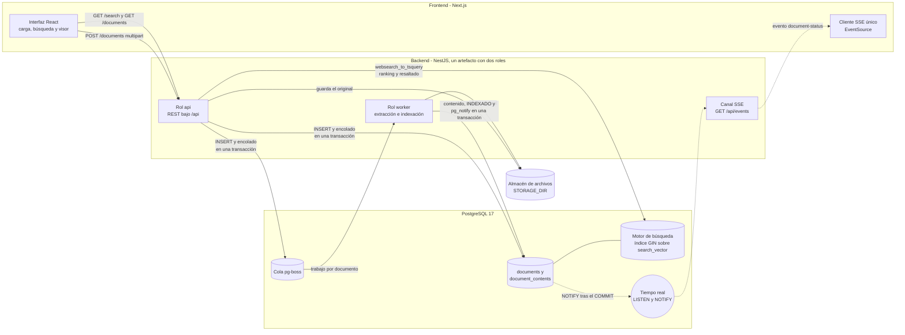
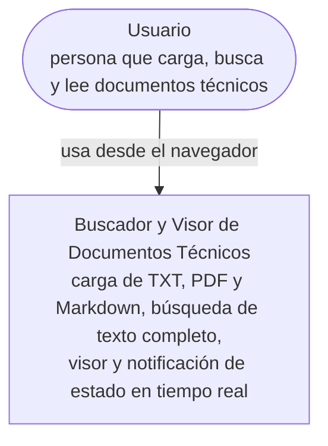
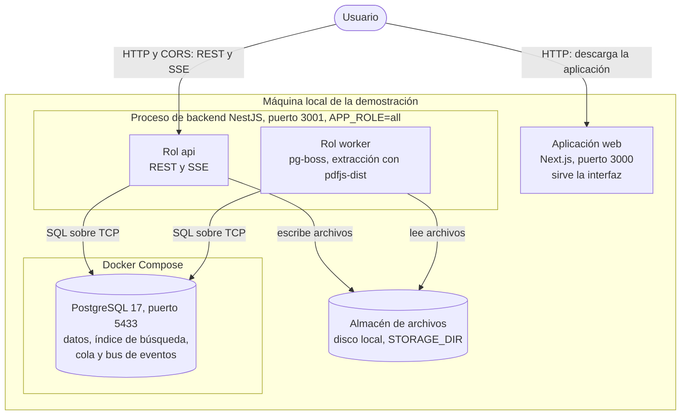
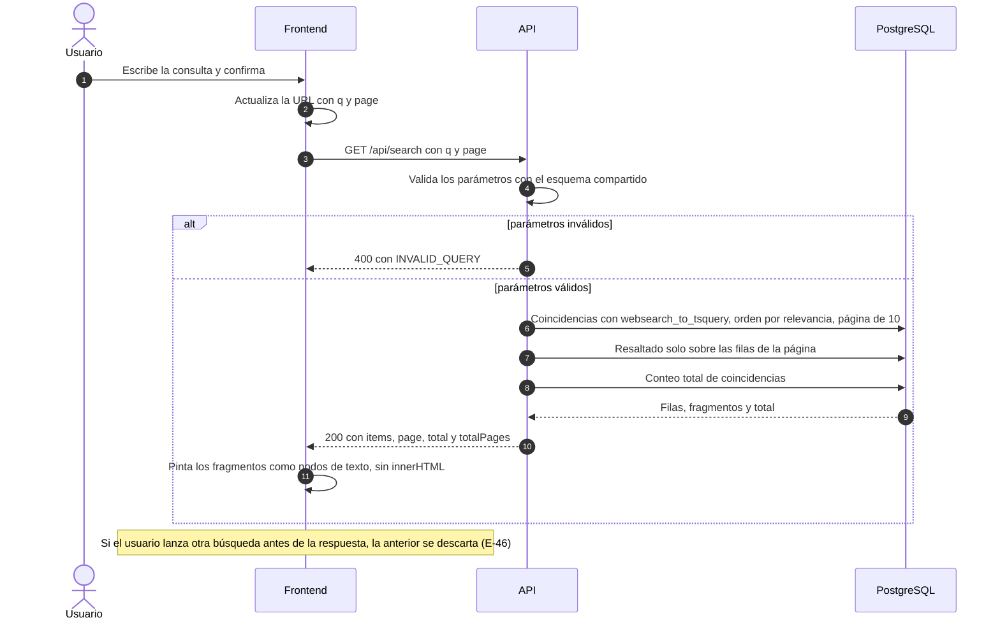
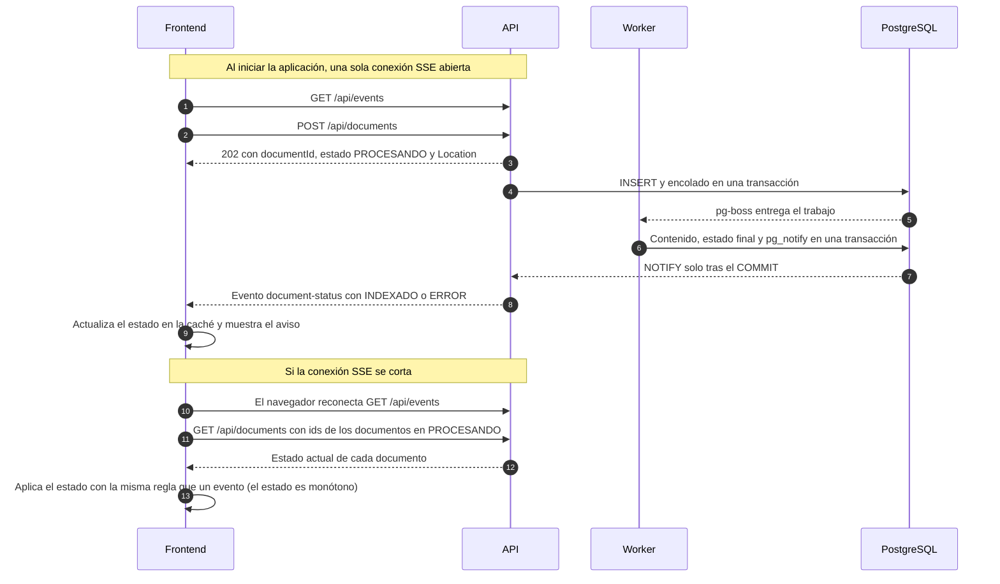
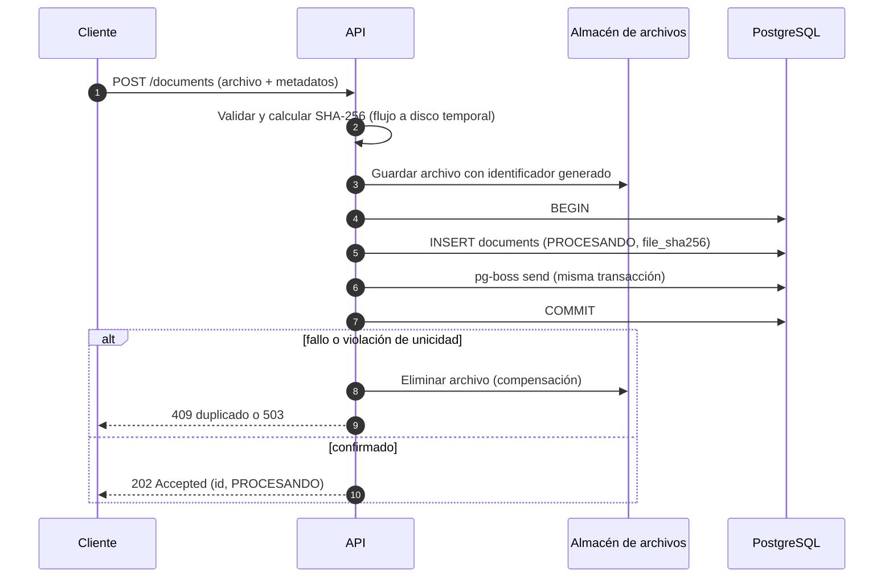
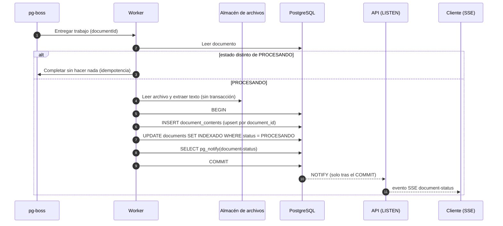
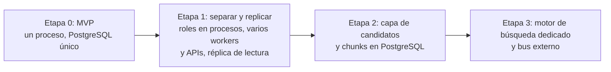

# Arquitectura: Buscador y Visor de Documentos Técnicos

Este documento describe cómo está construido el sistema, por qué se tomaron las decisiones principales y qué se dejó fuera de forma deliberada. Cada decisión se registra como un ADR (registro de decisión de arquitectura) con su contexto, las opciones evaluadas, la justificación y los compromisos aceptados. Las cifras de rendimiento provienen de mediciones guardadas en `docs/evidence/`; los valores que son criterio de ingeniería y no resultado de una medición se declaran como tales (sección 7.3).

## Índice

1. Alcance, supuestos y trazabilidad con el enunciado
2. Requisitos no funcionales
3. Vistas de arquitectura
4. Decisiones arquitectónicas (ADR)
5. Patrones de diseño, estilos y prácticas
6. Catálogo de casos de borde
7. Trade-offs consolidados
8. Escalabilidad ante un aumento masivo de documentos

---

## 1. Alcance, supuestos y trazabilidad con el enunciado

### 1.1 Supuestos e interpretaciones

- **Latencia "400 ms a 1 s".** Se interpreta como un techo: p95 de búsqueda menor o igual a 1000 ms. No se introducen retardos artificiales para alcanzar el piso de 400 ms. La interpretación se declara de forma explícita y se respalda con un benchmark.
- **Entorno de demostración.** Local. PostgreSQL corre en Docker; el backend y el frontend corren en el equipo anfitrión.
- **Prohibición de `LIKE`.** Ninguna consulta del motor de búsqueda usa `LIKE`, `ILIKE` ni equivalentes sin índice de búsqueda.

### 1.2 Trazabilidad con el enunciado

La tabla indica dónde se cubre cada requisito del enunciado.

| Requisito | Dónde se cubre |
| :-- | :-- |
| Estructura del repositorio (`backend/`, `frontend/`, `packages/shared/`) | ADR-02, ADR-09, ADR-12 |
| `docker-compose.yml`, `README.md` y `.env.example` en backend y frontend | ADR-14, ADR-15 |
| Diagrama de arquitectura con frontend, backend, motor de búsqueda y tiempo real | Sección 3 |
| Justificación de stack, base de datos y motor de búsqueda, y cumplimiento de la latencia | ADR-02, ADR-03 y `docs/evidence/` |
| Estrategia de tiempo real | ADR-07 |
| Escalabilidad ante un aumento masivo de documentos | Sección 8 |
| Justificación de la arquitectura elegida | ADR-01, ADR-09 y sección 5 |
| HU-01: carga con metadatos, validación y respuesta inmediata en estado `PROCESANDO` | ADR-04, ADR-06, ADR-08, ADR-10, ADR-11 |
| HU-02: búsqueda por título, metadatos y contenido, sin `LIKE`, con paginación y resaltado | ADR-03, ADR-11, ADR-12 |
| HU-03: visor con contenido y metadatos completos | ADR-10, ADR-11, ADR-12 |
| HU-04: notificación de `INDEXADO` o `ERROR` sin sondeo | ADR-07, ADR-08 |
| Manejo de errores y validación de datos | ADR-11, ADR-14 |
| Pruebas unitarias y de integración (Jest) y pruebas del frontend | ADR-13 |
| Evidencia de rendimiento con un conjunto de datos masivo | ADR-13 y `docs/evidence/api-benchmark/` |
| Uso de inteligencia artificial | `docs/ia.md` |

---

## 2. Requisitos no funcionales

| Atributo | Requisito | Verificación |
| :-- | :-- | :-- |
| Latencia de búsqueda | p95 menor o igual a 1000 ms. Verificado en la base de datos en el peor caso (documentos exactamente en el tope de indexación, páginas de 10): p95 máximo de 607,4 ms. Verificado por la API con 5.000 documentos de perfil mixto, 1 y 5 clientes: peor p95 de 491,7 ms, tras corregir el uso del índice y acotar el resaltado (ADR-03) | `docs/evidence/fts-capacity/` y `docs/evidence/api-benchmark/` (ADR-13) |
| Respuesta de carga | La API responde de inmediato (asíncrona) con ID y estado `PROCESANDO` | Prueba de integración |
| Notificación | El cliente se entera del cambio de estado sin polling | Prueba de integración del canal de eventos |
| Resiliencia | Un fallo del procesamiento no altera destructivamente el documento ni el archivo original | Casos de borde E-12 a E-15 |
| Escalabilidad | El procesamiento escala horizontalmente sin modificar el dominio | Sección 8 |
| Seguridad | Validación por contenido real del archivo, sanitización de nombre y de Markdown, límites de tamaño | Casos de borde E-01 a E-06, E-24 |
| Testabilidad | Cobertura mínima del 80% en las capas lógicas del backend (piso, no techo), exigida por Jest (ADR-13) | Reporte de cobertura de Jest |
| Configuración | Todo parámetro sensible o de entorno en `.env`, validado al arranque | Caso E-29 |

---

## 3. Vistas de arquitectura

Las vistas resumen las decisiones de la sección 4. Los diagramas del flujo de carga y del worker están en ADR-08.

### 3.1 Vista general: frontend, backend, motor de búsqueda y tiempo real



| Elemento exigido por el enunciado | Componente | Decisión |
| :-- | :-- | :-- |
| Frontend | Next.js con TanStack Query y un único `EventSource` | ADR-12 |
| Backend | NestJS, módulos `documents`, `search` y `notifications`, roles `api` y `worker` | ADR-01, ADR-09 |
| Motor de búsqueda | Búsqueda de texto completo de PostgreSQL (`tsvector`, GIN, configuración `es_unaccent`) | ADR-03 |
| Mecanismo de tiempo real | SSE hacia el navegador y `LISTEN/NOTIFY` entre worker y API | ADR-07 |

### 3.2 C4 nivel 1: contexto



El sistema no depende de servicios externos: no hay proveedor de identidad, correo, almacenamiento en la nube ni APIs de terceros (ADR-14: sin autenticación en el MVP).

### 3.3 C4 nivel 2: contenedores



- El navegador llama a la API directamente (CORS, ADR-14) y no a través del servidor de Next.js, que puede almacenar en búfer las respuestas de flujo (ADR-07). Next.js solo entrega la aplicación (ADR-12).
- En desarrollo los dos roles comparten un proceso; en producción serían procesos separados que se escalan de forma independiente (sección 8).
- PostgreSQL cumple cuatro funciones (datos, índice de búsqueda, cola y bus de eventos). Es una decisión de simplicidad operativa con evolución identificada en cada caso (ADR-03, ADR-04, ADR-07).

### 3.4 Secuencia de búsqueda (HU-02)



### 3.5 Secuencia de tiempo real y reconciliación (HU-04)



---

## 4. Decisiones arquitectónicas (ADR)

### ADR-01: Estilo arquitectónico general

- **Contexto:** La ruta de escritura (carga, extracción, indexación) es pesada y asíncrona. La ruta de lectura (búsqueda) exige baja latencia. La entrega es de un día y se evalúa la escalabilidad.
- **Opciones evaluadas:**
  - (a) Monolito modular en un solo proceso.
  - (b) Monolito modular con el mismo artefacto ejecutable en dos roles: `api` y `worker`.
  - (c) Microservicios (carga, indexador, búsqueda).
- **Decisión:** (b). Un repositorio, un artefacto y tres módulos: `documents` (ciclo de vida, carga, visor), `search` (consulta) y `notifications` (tiempo real). El worker es un perfil de arranque del mismo código.
- **Justificación técnica:**
  - Aísla el pico de CPU y memoria de la extracción de PDF de la latencia de la API de búsqueda.
  - El worker escala horizontalmente como consumidor competitivo sin tocar el dominio.
  - Separa el modelo de escritura del de lectura (CQRS ligero): el índice de búsqueda es el modelo de lectura y se optimiza sin contaminar el dominio.
  - Evita el costo operativo de los microservicios (red, despliegues independientes, trazabilidad distribuida), sin beneficio en el alcance actual.
- **Trade-off:** Se sacrifica el despliegue independiente por módulo. Las fronteras entre módulos quedan listas para extraer `search` como servicio propio.
- **Consecuencia:** El perfil de arranque (`api`, `worker`, `all`) es una decisión de configuración, no de código. En desarrollo local corre todo en un proceso.

### ADR-02: Stack tecnológico

- **Contexto:** El enunciado permite Express, NestJS, FastAPI, Spring Boot o Quarkus en backend, y React, Next.js o Angular en frontend. El equipo tiene experiencia con NestJS y Next.js. Las pruebas se ejecutan con Jest en ambos lados. La demo es local con la base de datos en Docker.
- **Opciones evaluadas:**
  - (A) Java 21 + Spring Boot + Angular.
  - (B) NestJS + Next.js con `packages/shared` en TypeScript.
- **Decisión:** (B). Backend NestJS, frontend Next.js, TypeScript de extremo a extremo, monorepo con `packages/shared`, Jest en backend y frontend.
- **Justificación técnica:**
  - Un solo lenguaje y un paquete compartido: los DTOs, el enum `DocumentStatus` y el contrato de eventos SSE se definen una vez y se consumen en ambos lados. Esto elimina la desincronización de contratos entre frontend y backend.
  - La inyección de dependencias de NestJS soporta directamente el principio de inversión de dependencias (puertos como tokens de inyección) y los filtros, pipes e interceptores cubren el manejo de errores y la validación como preocupaciones transversales.
  - NestJS ofrece soporte nativo para SSE (`@Sse`) y para el ciclo de vida de módulos, lo que facilita los perfiles `api` y `worker`.
  - Next.js aporta enrutamiento, compilación y estructura de proyecto conocidos. En el MVP todas las vistas obtienen los datos en el cliente (ADR-12); el renderizado en servidor queda como evolución.
  - Jest es el estándar tanto para NestJS (ts-jest) como para Next.js (`next/jest` con Testing Library).
- **Trade-offs:**
  - Se pierde la extracción de PDF más robusta del ecosistema JVM. Se mitiga aislando la extracción detrás de un puerto (`TextExtractorPort`) y tratando cualquier fallo como estado `ERROR` controlado.
  - Node es de un solo hilo por proceso. Las tareas de CPU pesada se aíslan en el rol `worker` (ADR-01).
- **Consecuencia:** El monorepo usa workspaces de npm. `packages/shared` debe compilarse antes de backend y frontend.

### ADR-03: Motor de búsqueda y modelo de indexación

- **Contexto:** HU-02 exige búsqueda por título, metadatos y contenido, con paginación y resaltado, sin `LIKE`. La demo es local con un contenedor de base de datos. El texto es en español.
- **Opciones evaluadas:**
  - PostgreSQL con búsqueda de texto completo (`tsvector` y GIN).
  - MongoDB con índice de texto nativo (`$text`).
  - MongoDB Search (`mongot`, basado en Lucene).
  - Elasticsearch u OpenSearch.
- **Decisión:** PostgreSQL FTS detrás de `SearchIndexPort`, con una configuración de búsqueda propia, `es_unaccent` (diccionario `unaccent` seguido del lematizador `spanish`), ver "Composición del vector y de la consulta".
  - Un vector por documento en la tabla `document_contents` (relación 1:1 con `documents`).
  - Se almacena el texto extraído completo. La indexación y el resaltado operan sobre un prefijo de como máximo `MAX_INDEXABLE_CHARS` caracteres.
  - La fragmentación en chunks queda como evolución documentada (ver "Escalabilidad futura"), detrás del puerto `ChunkingStrategy`.
- **Justificación técnica:**
  - El documento y su índice se escriben en la misma transacción: si el cliente recibe `INDEXADO`, el documento ya es buscable.
  - Un solo contenedor con estado (base de datos, búsqueda y cola).
  - `$text` de MongoDB no ofrece resaltado ni almacena proximidad de palabras. MongoDB Search cubre ambas cosas, pero exige replica set y un proceso adicional, tiene consistencia eventual y deja fuera a `pg-boss`.

#### Derivación del límite de indexación (evidencia en `docs/evidence/fts-capacity/`)

El límite no es un valor arbitrario. Se derivó de cuatro mediciones sobre PostgreSQL 17 con texto en español (detalle, scripts, resultados y limitaciones en el README de la carpeta de evidencia):

1. **Límite duro del vector.** Con texto natural, 6,8 millones de caracteres (todo el corpus) producen un vector de 343.712 bytes, lejos del máximo de 1.048.575. En el peor caso (tokens únicos de 32 caracteres, como hashes o identificadores) el vector alcanza 1.013.376 bytes con 824.999 caracteres y falla con 989.999. El tope debe quedar por debajo de 824.999 caracteres con margen.
2. **Precisión de frases.** La posición máxima que registra un vector es 16.383. Se alcanza hacia el carácter 89.443 (unas 34 páginas). Más allá, una frase exacta no se encontró en el vector completo (desplazamientos de 500.000 y 1.000.000 caracteres), aunque sí en una ventana local. No genera errores; degrada la precisión.
3. **Costo del resaltado.** `ts_headline` es lineal: 10,9 ms con 100.000 caracteres, 31,0 ms con 300.000, 56,0 ms con 500.000 y 206,6 ms con 2.000.000. Es el componente dominante de la latencia. El costo de resaltar en una solicitud es aproximadamente `PAGE_SIZE x MAX_INDEXABLE_CHARS x 0,1 ms por cada 1.000 caracteres`.
4. **Verificación en el peor caso.** Con todos los documentos midiendo exactamente el tope y páginas de 10 resultados (ranking y resaltado del texto completo):
   - Tope de 300.000 caracteres (3,0 millones de caracteres resaltados por solicitud): p95 entre 412,8 y 607,4 ms, máximo 636,2 ms.
   - Tope de 500.000 caracteres (5,0 millones): p95 entre 768,7 y 1.700,4 ms, máximo 1.816,5 ms. Supera el objetivo de 1 s.

Conclusión: 300.000 caracteres es el valor medido que cumple el objetivo con margen. 400.000 caracteres no se midió y no se adopta sin medirlo.

#### Uso del índice y ventana de resaltado (evidencia en `docs/evidence/api-benchmark/`)

El benchmark de la API con 5.000 documentos de perfil mixto (ADR-13) **no cumplió** el criterio en su primera corrida: peor p95 de 1.242,7 ms con 5 clientes. El diagnóstico encontró dos causas que las mediciones anteriores no habían detectado:

1. **El índice GIN no se usaba.** Las mediciones de la base de datos registraron tiempos, pero no inspeccionaron el plan de ejecución; se asumió que crear el índice implicaba usarlo. El planificador elegía un recorrido secuencial de `document_contents` (la tabla principal es pequeña porque vectores y texto viven en TOAST, y el costo de evaluar cada vector se subestima). Además, con el `tsquery` en un CTE unido por `CROSS JOIN` o en una subconsulta escalar, el planificador no puede usar el índice ni con el recorrido secuencial desactivado. Costo: unos 110 a 125 ms de CPU por solicitud, incluso sin resultados.
2. **El resaltado de la página domina con términos frecuentes** y crece con la longitud del texto (esta ADR ya lo advertía en la medición 3). Con el resaltado sobre el prefijo completo, `ts_headline` de las 10 filas de la página costó entre 350 y 450 ms con la palabra `caballero`.

Las correcciones fueron dos:

- **Estructura de la consulta:** los ids coincidentes se obtienen en un CTE materializado con `search_vector @@ websearch_to_tsquery('es_unaccent', q)` escrito en línea, y la transacción de búsqueda ejecuta `SET LOCAL enable_seqscan = off` (solo dentro de esa transacción) para que el planificador use el índice. Las pruebas de integración verifican con `EXPLAIN` que el plan usa `document_contents_search_vector_idx` y no recorre `document_contents`, de modo que una regresión falla en las pruebas y no solo en el benchmark.
- **Ventana de resaltado (`MAX_HIGHLIGHT_CHARS`, 100.000 caracteres):** `ts_headline` se calcula solo sobre los primeros `MAX_HIGHLIGHT_CHARS` caracteres del prefijo indexado. El ranking y la coincidencia siguen usando todo el vector indexado. **Nuevo límite conocido:** en un documento largo, una coincidencia que solo aparezca después de esa ventana hace que el documento aparezca en los resultados sin fragmento (igual que las coincidencias solo en metadatos); el visor (HU-03) sigue mostrando el texto completo.
- **Resultado:** con ambas correcciones, segunda corrida del benchmark: peor p95 de 491,7 ms (1 y 5 clientes), consulta sin resultados de 157 ms a 4,6 ms. Ver `docs/evidence/api-benchmark/README.md`.

#### Composición del vector y de la consulta

Las primeras mediciones usaron la configuración `spanish` sin `unaccent`. Al contrastar el diseño con HU-02 se ajustaron tres puntos (evidencia en `docs/evidence/fts-capacity/`, mediciones 5 a 11):

1. **Alcance de la búsqueda:** HU-02 pide buscar "palabras clave o frases" en título, metadatos y contenido. No pide búsqueda por términos relacionados. Se garantiza que una palabra escrita con o sin tilde encuentra los documentos que la contienen; la coincidencia por raíz (plurales y formas verbales) es un beneficio del lematizador, no un requisito.
2. **Título y metadatos:** el vector de cada documento se calcula una vez, en la transacción final (ADR-08), con pesos: título (`A`), autor, categoría, etiquetas y versión (`B`) y prefijo del contenido (`D`). Como los metadatos son inmutables en el MVP (ADR-11), no hay que recalcularlo. Sigue siendo un vector y un índice GIN por documento, la forma que se midió.
3. **Acentos:** se indexa y se consulta sin acentos mediante una configuración propia, definida una vez en la migración:

```sql
CREATE TEXT SEARCH CONFIGURATION es_unaccent (COPY = spanish);
ALTER TEXT SEARCH CONFIGURATION es_unaccent
  ALTER MAPPING FOR hword, hword_part, word WITH unaccent, spanish_stem;
```

   - **Por qué una configuración y no `unaccent(texto)` en cada llamada:** con la función, el resaltado falla. `ts_headline` analiza el texto original con la configuración indicada, y una palabra acentuada del documento no coincide con la consulta sin acento (verificado: la consulta "instalacion produccion" no resaltó nada en "La instalación ... producción"). Con `es_unaccent`, el mismo texto se resalta y el fragmento conserva las tildes originales (`[instalación] del servicio ... en [producción]`). Además no requiere funciones envoltorio inmutables. Es el patrón que documenta PostgreSQL.
   - **Comportamiento verificado** (medición 9, 13 consultas sobre 6 documentos): una palabra escrita con o sin tilde encuentra siempre los documentos que la contienen; los plurales de palabras comunes coinciden ("servicio" y "servicios", "documento" y "documentos"); las frases entre comillas funcionan con y sin tilde.
   - **Limitación conocida:** tras quitar el acento, el lematizador no reduce los sustantivos en "-ción" en singular: "instalación" no coincide con "instalaciones" ni con "instalar" (sí con "instalacion" y con la propia "instalación"). Es una consecuencia de que el lematizador de Snowball espera la tilde para reconocer el sufijo.
   - **Alternativas evaluadas:** (B) `simple` con `unaccent`: no lematiza ni los plurales ("servicio" no encuentra "servicios"); (C) `spanish` sin `unaccent`: una consulta sin tilde no encuentra el texto con tilde ("configuracion" no devolvió ningún documento); (D) vector doble, con y sin acentos, que sí resuelve los sustantivos en "-ción": suma un 10 % al vector (78 a 86 kB) y un 8 % al índice (13 a 14 MB), exige dos funciones y una consulta doble, y resuelve un caso que el enunciado no pide. Se descarta para el MVP y queda como evolución.
   - **Costo medido con `es_unaccent`** (1.500 documentos de 300.000 caracteres): vector promedio de 81 kB (78 kB con `spanish`), índice GIN de 14 MB (13 MB con `spanish`), ranking más resaltado con p95 entre 476 y 554 ms y máximo de 617 ms con la caché caliente (413 a 541 ms y 604 ms con `spanish`). La primera consulta tras construir el índice, con la caché fría, llegó a p95 de 787 ms; conviene una búsqueda de calentamiento antes de la demostración.
   - **Consulta:** `websearch_to_tsquery('es_unaccent', q)`, que también elimina los acentos de la consulta.

#### Restricciones resultantes

| Parámetro | Valor inicial | Origen |
| :-- | :-- | :-- |
| `MAX_INDEXABLE_CHARS` | 300.000 caracteres | Medición 4 |
| `MAX_HIGHLIGHT_CHARS` | 100.000 caracteres; no puede superar `MAX_INDEXABLE_CHARS` (se verifica al arrancar, E-29) | Benchmark de la API (`docs/evidence/api-benchmark/`): reduce alrededor de un 45 % la latencia de términos frecuentes. Valor de criterio de ingeniería: no se midieron otras ventanas |
| `PAGE_SIZE` | 10 resultados, fijo (constante de `packages/shared`, no configurable por la API) | Medición 4 (la verificación se hizo con páginas de 10) |
| Invariante `PAGE_SIZE x MAX_INDEXABLE_CHARS <= 3.000.000` | Verificada al arrancar; si no se cumple, el arranque falla (E-29) | Mediciones 3 y 4 |
| `MAX_UPLOAD_BYTES_TEXT` y `MAX_UPLOAD_BYTES_PDF` (ADR-14) | TXT y Markdown: 3 MB. PDF: 20 MB | TXT/MD: coherencia con `MAX_EXTRACTED_CHARS` (un byte por carácter como mínimo). PDF: probado hasta 23 MB sin costo relevante (`docs/evidence/upload-limits/`) |
| `MAX_PDF_PAGES` | 1.000 páginas; un PDF con más páginas pasa a `ERROR` con motivo `PDF_TOO_MANY_PAGES`, antes de extraer | Extracción: 1.000 páginas en 2,5 a 3,2 s y 166 MB de pico; 20.000 páginas casi vacías: 40 a 106 s y 264 MB |
| `MAX_EXTRACTED_CHARS` | 3.000.000 caracteres; si se supera durante la extracción, el documento pasa a `ERROR` con motivo `TEXT_TOO_LARGE` | Mayor volumen medido: 2,6 millones de caracteres (PDF de 1.000 páginas). Acota el texto guardado y la respuesta del visor |
| `EXTRACTION_TIMEOUT_MS` | 60.000 | Criterio de ingeniería: unas 20 veces el peor caso aceptado y medido (3,2 s), porque los PDFs reales son más lentos que los sintéticos |
| `WORKER_CONCURRENCY` | 2 extracciones simultáneas por proceso worker | Criterio derivado de la memoria: cada extracción suma entre 50 y 100 MB sobre la línea base de 69 MB. No se midió concurrencia |

Reglas de extracción e indexación:

- Si el texto extraído supera `MAX_INDEXABLE_CHARS`, se indexa el prefijo, cortado en un límite de párrafo o de palabra. Se guardan `total_chars`, `indexed_chars` y `is_partially_indexed`. El visor muestra el texto completo con un aviso de indexación parcial. El resaltado de la búsqueda se hace solo sobre los primeros `MAX_HIGHLIGHT_CHARS` caracteres del prefijo indexado.
- Si `to_tsvector` falla por el límite del vector (caso de texto con muchos identificadores únicos), se reintenta con la mitad del prefijo hasta tres veces. Si persiste, el documento pasa a `ERROR` con motivo `INDEX_LIMIT_EXCEEDED`.
- El límite de indexación se controla por caracteres extraídos, no por megabytes: el peso de un PDF depende de imágenes y tipografías, no del texto (PDF de 23 MB con 78.000 caracteres frente a PDF de 2,3 MB con 2,6 millones).
- El número de páginas se lee al abrir el PDF (entre 90 y 330 ms) y se valida contra `MAX_PDF_PAGES` antes de extraer. Pasa a `ERROR` en lugar de truncarse porque el visor (HU-03) muestra el texto completo guardado; truncar dejaría un documento incompleto sin aviso equivalente.
- El límite de peso se valida en streaming durante la carga (el archivo va a disco temporal, no a memoria) y el SHA-256 se calcula sobre el mismo flujo.
- La extracción cede el control entre páginas: el bloqueo continuo del hilo principal medido fue de 25 a 94 ms. La separación de los roles `api` y `worker` (ADR-01) aísla CPU y memoria, no evita un bloqueo largo del bucle de eventos.

Guía de expectativas por formato (con 2.600 caracteres por página, supuesto no medido):

| Alcance | Caracteres | Páginas aproximadas | Comportamiento |
| :-- | :-- | :-- | :-- |
| Precisión completa, incluidas frases exactas | Hasta unos 89.000 | Hasta unas 34 | Todas las funciones exactas |
| Indexación completa por palabras | Hasta 300.000 | Hasta unas 115 | Palabras y ranking completos; frases exactas garantizadas solo en las primeras 34 páginas |
| Indexación parcial | Más de 300.000 | Más de unas 115 | Se indexa el prefijo con aviso visible |

- **TXT:** 300.000 caracteres pesan unos 310 KB (entre 1,016 y 1,046 bytes por carácter en español).
- **Markdown:** se guarda e indexa la fuente tal cual (ADR-10); el archivo pesa algo más que su texto visible (no medido).
- **PDF:** se controla por caracteres extraídos. Un PDF escaneado, sin texto, termina en `ERROR` (E-08).

#### Escalabilidad futura: fragmentación en chunks (trade-off aceptado)

La fragmentación no se implementa ahora. Se documenta como la evolución que elimina las limitaciones de este diseño: divide cada documento en varios fragmentos con su propio vector, de modo que ninguno se acerca a los topes.

- **Diseño previsto:** tabla `document_chunks` con `document_id`, orden, ruta de sección o página, texto para mostrar (sin solapamiento) y vector para buscar (con una cola de unas 30 palabras del fragmento siguiente, para no perder frases en las fronteras). Tamaño objetivo de unos 2.000 caracteres. División por bloques estructurales (secciones de Markdown, páginas de PDF, párrafos de TXT).
- **Consulta:** se agrupa por documento; la puntuación es la del mejor fragmento más una bonificación por cantidad de fragmentos coincidentes; el resaltado se aplica solo al mejor fragmento de cada resultado de la página.
- **Qué resuelve:** el tope de 16.383 posiciones, el contenido posterior al límite y el costo lineal del resaltado (permitiría retirar el invariante de tamaño de página por tope).
- **Retos ya identificados:** ranking entre fragmentos (PostgreSQL no tiene frecuencia inversa de documento), términos de una misma consulta en fragmentos distintos, multiplicación de filas y costo del ranking con términos muy frecuentes, paginación profunda, y costo de escritura del índice GIN con cargas masivas.
- **Punto de extensión:** el puerto `ChunkingStrategy`. La estrategia actual es de un solo fragmento con tope; la evolución reemplaza la estrategia y la tabla sin cambiar la API ni el frontend.

- **Trade-off:** se sacrifica precisión de frases exactas después de las primeras 34 páginas y la búsqueda sobre el contenido posterior al tope. Se gana simplicidad de consulta, de operación y de pruebas.
- **Costo del total exacto (`total` de la respuesta, ADR-11):** contar las coincidencias tarda entre 0,1 y 0,6 ms con la caché caliente y hasta 141 ms en la primera ejecución con la caché fría (1.500 documentos; medido sobre el vector doble descartado, de tamaño similar).
- **Limitaciones de la evidencia:** corpus literario (no técnico); documentos formados por rebanadas de un corpus de 6,8 millones de caracteres, con más coincidencias por consulta que un corpus real; entre 900 y 4.000 documentos, no 100.000; un solo cliente y configuración por defecto de PostgreSQL. El costo del ranking crece con la cantidad de documentos coincidentes, no con el tamaño total del corpus; con volúmenes mucho mayores hará falta una capa de candidatos (ver sección 8).

### ADR-04: Procesamiento asíncrono y cola

- **Contexto:** HU-01 exige respuesta inmediata con identificador y estado `PROCESANDO`. El procesamiento (extracción e indexación) debe ser resiliente y escalable.
- **Opciones evaluadas:** BullMQ con Redis, `pg-boss` sobre PostgreSQL, cola en memoria.
- **Decisión:** `pg-boss`, detrás de `JobQueuePort`.
- **Justificación técnica:**
  - Encolado transaccional: el registro del documento y el trabajo se insertan en la misma transacción. Con una cola externa hay una escritura doble y un fallo intermedio deja documentos en `PROCESANDO` para siempre.
  - Consumidores competitivos con `SKIP LOCKED`, aptos para varias instancias.
  - Reintentos con backoff exponencial, expiración, cola de mensajes fallidos con reenvío y deduplicación por clave disponibles sin código propio.
  - Un solo servicio con estado: la demo local necesita un único contenedor.
  - Estado de la cola observable con SQL.
- **Trade-offs:**
  - Rendimiento máximo menor que Redis y más carga sobre la base de datos con volúmenes muy altos; se mitiga con el puerto.
  - Un trabajo se entrega a un solo consumidor a la vez, pero un fallo posterior a un efecto secundario provoca reintento. Por eso los manejadores son idempotentes.
  - Con un pool de conexiones en modo transacción, la entrega de baja latencia por `LISTEN/NOTIFY` no funciona y la librería usa sondeo.
- **Consecuencia:** La capa de acceso a datos debe permitir compartir la transacción con la cola (ADR-05).

### ADR-05: Acceso a datos

- **Contexto:** Las consultas de búsqueda usan funciones específicas de PostgreSQL. Se requiere migraciones, restricciones únicas, columnas `tsvector` e índices GIN, y compartir transacción con la cola.
- **Opciones evaluadas:** Drizzle, Kysely, TypeORM, Prisma.
- **Decisión:** Drizzle ORM, con SQL explícito mediante la etiqueta `sql` para las consultas de búsqueda.
- **Justificación técnica:**
  - El esquema definido en TypeScript es la fuente única de tipos y de estructura, y sirve como documentación viva.
  - Soporta columnas de tipo `tsvector` e índices GIN de forma declarativa, y genera migraciones a partir de las diferencias.
  - Tiene adaptador documentado para compartir la transacción con `pg-boss`.
  - Las consultas de búsqueda se escriben como SQL propio, sin capa de abstracción que estorbe.
- **Trade-offs:** La validación en compilación de consultas complejas es menos estricta que en Kysely. Las extensiones (`unaccent`) y la configuración de idioma requieren editar la migración generada. La versión se fija en el repositorio.
- **Consecuencia:** Los repositorios de infraestructura encapsulan Drizzle detrás de los puertos; el dominio no lo importa.

### ADR-06: Detección de duplicados

- **Contexto:** El enunciado no exige detectar duplicados: HU-01 pide validar formato y tamaño y responder de inmediato. Es una regla adicional, por lo que debe ser de bajo costo y no comprometer la respuesta inmediata.
- **Decisión:** Se rechaza con 409 todo archivo cuya huella SHA-256 ya exista. La huella se calcula en el servidor sobre los bytes del archivo, en una sola pasada mientras se recibe. El archivo duplicado no se conserva. La respuesta incluye el identificador y el estado del documento existente. No se detectan duplicados por título, tags o categoría.
- **Justificación técnica:**
  - Costo: el SHA-256 de un archivo de 20 MB tarda entre 10 y 12 ms y el de uno de 100 MB unos 60 ms (medido con `docs/evidence/sha256-cost/hash-benchmark.js`). La búsqueda del duplicado es una consulta por un índice B-tree.
  - Exactitud: la huella depende solo de los bytes. Cambiar el título u otro metadato no la modifica; solo cambia si cambia el contenido del archivo.
  - Margen de error: la probabilidad de que dos archivos distintos compartan huella es de unos 4,3 x 10^-60 con mil millones de archivos (cota de la paradoja del cumpleaños). No se conocen colisiones prácticas de SHA-256.
  - Título, tags y categoría se descartan como criterio: los tags y las categorías se comparten por diseño, y un mismo título puede corresponder a versiones legítimas.
- **Concurrencia:** índice único sobre `file_sha256`. Si dos cargas idénticas llegan a la vez, la segunda produce una violación de unicidad que se traduce a 409 y se elimina su archivo temporal.
- **Documentos en `ERROR`:** la reindexación y el borrado por API quedan fuera del alcance (el enunciado no los pide). Consecuencia: mientras exista un documento en `ERROR`, el mismo archivo recibe 409. Se resuelve con un procedimiento operativo manual: un script de mantenimiento (`npm run docs:purge-errors`) que elimina los documentos en `ERROR`. El índice único sigue siendo simple (no parcial).
  - **Por qué un script y no una consulta SQL suelta:** el borrado debe alcanzar tres lugares, no solo la fila: el archivo almacenado, el contenido indexado (`document_contents`, por `ON DELETE CASCADE`) y los trabajos de `pg-boss` asociados. Una consulta SQL dejaría archivos huérfanos.
  - **Reglas de seguridad del script:** modo simulación por defecto (lista lo que borraría) y borrado real solo con `--confirm`; el borrado filtra `status = 'ERROR'` dentro de la misma sentencia, de modo que un documento que cambie de estado durante la ejecución no se elimina; filtros opcionales por motivo y antigüedad; registra cada documento eliminado; usa el puerto `FileStorage` y no toca archivos por ruta.
  - **Limitación para la demostración:** un error en vivo no se recupera desde la interfaz; hay que ejecutar el script. Conviene preparar archivos de demostración que no fallen.
- **Trade-offs:**
  - No detecta duplicados semánticos: un PDF re-exportado con el mismo texto, saltos de línea distintos o un TXT y un Markdown con el mismo contenido tienen huellas distintas.
  - Un mismo archivo no puede existir con dos conjuntos de metadatos.
  - En la demostración, subir dos veces el mismo archivo devuelve 409 con el enlace al documento existente; conviene preparar archivos distintos.
- **Fuera de alcance (trade-off):** reindexar un documento existente (`POST /documents/:id/reindex`). Recuperaría documentos en `ERROR` por fallos transitorios, conservando el identificador, y serviría de mecanismo de migración a chunks. No se implementa porque el enunciado no lo pide; se añade después, cuando el script de limpieza deje de ser suficiente. Requerirá permitir la transición `ERROR -> PROCESANDO` solo por esa vía y conservar el archivo original de los documentos en `ERROR`.
- **Evolución:** huella del texto normalizado para duplicados semánticos, y cálculo previo de la huella en el navegador (Web Crypto) para evitar enviar el archivo.

### ADR-07: Mecanismo de tiempo real

- **Contexto:** HU-04 exige notificar `INDEXADO` o `ERROR` sin sondeo. El cambio de estado lo produce el proceso worker, que es distinto del proceso que mantiene las conexiones con los navegadores (ADR-01). El canal debe sobrevivir a cortes de conexión sin perder el estado final.
- **Opciones evaluadas:**
  - **Sondeo corto o largo (long polling):** descartado por el enunciado.
  - **WebSocket:** bidireccional; el cliente no tiene nada que enviar. Exige un protocolo aparte, reconexión y latido manuales, y complica el paso por proxies.
  - **Suscripciones GraphQL:** exigen adoptar GraphQL para un solo evento; el resto del contrato es REST (ADR-11).
  - **SSE (Server-Sent Events):** unidireccional servidor a cliente sobre HTTP simple.
- **Decisión:** SSE con un único canal global `GET /api/events`, y `LISTEN/NOTIFY` de PostgreSQL como bus entre worker e instancias de API. Un evento `document-status` con carga mínima: `documentId`, `status`, `reason` (solo en `ERROR`) y `occurredAt`. No lleva título ni metadatos: el cliente ya los tiene.
- **Justificación técnica:**
  - **Encaje con el problema:** el flujo es de un solo sentido. SSE es HTTP, se prueba con `curl`, atraviesa proxies sin protocolo nuevo y el navegador reconecta solo (`retry` configurado en 3 s). NestJS lo soporta de forma nativa (`@Sse`).
  - **Un canal por pestaña, no por documento:** los navegadores limitan las conexiones HTTP/1.1 por origen (unas seis); una conexión por documento en seguimiento las agotaría. El cliente filtra localmente los identificadores que le interesan.
  - **Puente entre procesos sin infraestructura nueva:** un `EventEmitter` en memoria no sirve porque worker y API son procesos distintos; Redis añadiría un contenedor solo para esto. `LISTEN/NOTIFY` ya está disponible porque PostgreSQL y `pg-boss` son parte del diseño (ADR-04).
  - **Coherencia con el cambio de estado:** `pg_notify` ejecutado dentro de la misma transacción que el `UPDATE` del estado solo se entrega si esa transacción confirma. No puede haber un evento de un cambio que se revirtió (se formaliza en ADR-08).
  - **Latencia medida** (`docs/evidence/realtime-latency/`, PostgreSQL 17 local): desde el commit hasta el cliente, p95 de 7 ms con 1 cliente, de 13 a 15 ms con 100 y de 97 a 162 ms con 1.000 conectados, sin pérdidas de entrega. La cifra es conservadora porque servidor y clientes compartían proceso.
- **Entrega y reconciliación:**
  - `NOTIFY` no guarda historial: un oyente desconectado pierde el mensaje. Se acepta una entrega de tipo "como máximo una vez" y se compensa con reconciliación en el cliente: al conectar o reconectar, primero se abre el flujo y después se consulta el estado actual de los documentos en `PROCESANDO` que el cliente sigue (`GET /documents?ids=...`). El estado es monótono (`PROCESANDO` solo avanza a `INDEXADO` o `ERROR`), por lo que el evento y la consulta se aplican en cualquier orden sin conflicto.
  - No se implementa `Last-Event-ID` ni repetición de eventos: la reconciliación por consulta cubre el mismo caso con menos piezas (cierra E-26).
- **Operación de las conexiones:**
  - Latido: comentario SSE cada 25 s para evitar el cierre por inactividad de proxies; las conexiones muertas se detectan al fallar la escritura y al evento `close`, y se liberan.
  - Cabeceras: `Cache-Control: no-cache, no-transform` y `X-Accel-Buffering: no`; sin compresión sobre el flujo.
  - Tope configurable de conexiones abiertas por instancia (`MAX_SSE_CLIENTS`, validado al arrancar); al superarlo, 503 con `Retry-After`.
  - El frontend se conecta directamente al backend (CORS configurado) y no a través del servidor de Next.js, que puede almacenar en búfer las respuestas de flujo.
  - Si el escuchador de PostgreSQL pierde su conexión, se reabre con reintentos y, al restablecerse, se emite un evento de resincronización para que los clientes reconcilien.
- **Trade-offs:**
  - `EventSource` no permite cabeceras personalizadas: si más adelante se añade autenticación por token, hay que usar cookies o un cliente SSE basado en `fetch`. Hoy no hay autenticación (ADR-14).
  - El canal global difunde el estado de todos los documentos a todos los clientes. Es aceptable mientras no haya usuarios ni permisos; con ellos, el canal se filtra por usuario.
  - `LISTEN` exige una conexión de base de datos dedicada, fuera del pool y sin PgBouncer en modo transacción (ya asumido en ADR-04).
  - Una carga alta de eventos sobre miles de clientes se resuelve mejor con un bus dedicado; queda como evolución.
- **Evolución:** reemplazar `LISTEN/NOTIFY` por Redis Pub/Sub o NATS detrás del puerto `EventPublisher`, sin cambiar el contrato SSE; añadir difusión filtrada por usuario.

### ADR-08: Consistencia entre archivo, base de datos, cola y eventos

- **Contexto:** una carga toca cuatro recursos que no comparten transacción con el sistema de archivos: el archivo almacenado, la fila del documento, el trabajo en la cola y el evento de estado. El procesamiento posterior debe tolerar fallos parciales, entregas duplicadas y caídas del worker sin dejar un documento en un estado falso (por ejemplo `INDEXADO` sin contenido buscable o `PROCESANDO` para siempre).
- **Decisión:**
  1. **Una sola transacción por cambio de estado.** Cada cambio escribe, en la misma transacción, el estado del documento, su contenido indexado (si aplica) y la notificación `pg_notify`. En la carga se añade el encolado del trabajo con el adaptador `fromDrizzle` de `pg-boss`.
  2. **Transición con comparación y asignación.** La actualización lleva la condición del estado de origen (`UPDATE ... WHERE id = $1 AND status = 'PROCESANDO'`). Si afecta cero filas, otro proceso ya resolvió el documento: no se escribe ni se notifica.
  3. **El archivo se guarda antes de la transacción**, con compensación: si la transacción falla, se elimina el archivo.
  4. **La extracción y el cálculo del vector quedan fuera de las transacciones largas.** La extracción se hace sin transacción abierta; la transacción final solo inserta el contenido y cambia el estado.
  5. **Los fallos se clasifican.** Un error permanente (PDF escaneado, corrupto, cifrado, demasiado grande) marca `ERROR` de inmediato y completa el trabajo sin reintentos. Un error transitorio se relanza para que `pg-boss` reintente con backoff.
  6. **La cola de mensajes fallidos cierra el ciclo.** Si `pg-boss` agota los reintentos, o el trabajo expira porque el worker cayó, el trabajo pasa a una cola de mensajes fallidos (`documents.index.dlq`); un consumidor marca el documento `ERROR` con la misma transición condicionada.
  7. **El evento es una pista, no la fuente de verdad.** No se implementa una tabla de eventos pendientes (outbox).
  8. **Todo documento en `ERROR` conserva la causa.** El motivo se registra en la misma transacción que la transición, viaja en el evento y se muestra en el visor y en el detalle del documento (ver "Trazabilidad de la causa del error").
- **Flujo de carga:**



- **Flujo del worker:**



- **Trazabilidad de la causa del error:**
  - **Columnas de `documents`:** `last_error_code` (código del catálogo), `last_error_detail` (texto técnico truncado a 500 caracteres, sin rutas ni trazas), `last_error_at` y `attempts`. Restricción de base de datos: si `status = 'ERROR'`, `last_error_code` no puede ser nulo. Al pasar a `INDEXADO` estas columnas se limpian.
  - **Fallo transitorio:** en cada intento fallido, el manejador registra el código y el detalle del intento (sin cambiar el estado) y relanza el error. Si luego el trabajo llega a la cola de mensajes fallidos, su consumidor promueve el documento a `ERROR` con la causa ya registrada. Si no hay ninguna (el worker cayó y el trabajo caducó), usa `WORKER_LOST`.
  - **Fallo permanente:** el código y el detalle se escriben junto con la transición a `ERROR`, en una sola transacción.
  - **Qué se expone:** la API y el evento SSE devuelven el código y `attempts`; el frontend traduce el código a un mensaje comprensible. El detalle técnico se queda en la base de datos y en los registros, correlacionado por `documentId`; no sale por la API para no filtrar rutas ni mensajes internos.

| Código | Origen | Reintentos |
| :-- | :-- | :-- |
| `NO_EXTRACTABLE_TEXT` | PDF sin capa de texto (E-08) | No |
| `PDF_CORRUPT`, `PDF_ENCRYPTED` | PDF ilegible o protegido (E-09) | No |
| `ENCODING_UNSUPPORTED` | Texto plano no decodificable (E-10) | No |
| `TEXT_TOO_LARGE` | Supera `MAX_EXTRACTED_CHARS` (E-36) | No |
| `PDF_TOO_MANY_PAGES` | Supera `MAX_PDF_PAGES` (E-35) | No |
| `INDEX_LIMIT_EXCEEDED` | El vector supera el límite tras reducir el prefijo (E-34) | No |
| `EXTRACTION_TIMEOUT` | Supera `EXTRACTION_TIMEOUT_MS` (E-37) | Sí; al agotarse, `ERROR` |
| `PROCESSING_FAILED` | Fallo transitorio persistente (base de datos, almacenamiento) tras agotar reintentos (E-13) | Sí |
| `WORKER_LOST` | El worker cayó y el trabajo caducó sin causa registrada (E-41) | Sí |

- **Justificación técnica:**
  - **Atomicidad donde sí es posible.** Documento y trabajo en una transacción evitan el fallo clásico de la doble escritura: un documento sin trabajo (queda en `PROCESANDO` para siempre) o un trabajo sin documento. Contenido, estado y notificación en una transacción garantizan que un documento `INDEXADO` siempre es buscable, y que un evento nunca anuncia un cambio revertido. Como la búsqueda solo considera `INDEXADO` (E-20), no existe una ventana en la que el documento aparezca sin su vector.
  - **La comparación de estado hace inofensivas las entregas duplicadas.** `pg-boss` no garantiza una única ejecución. Si dos workers procesan el mismo documento, solo el primero que confirma cambia el estado; el segundo obtiene cero filas y descarta su trabajo. Es la implementación de la idempotencia de E-14 y no requiere bloqueos explícitos. El nivel de aislamiento por defecto (`READ COMMITTED`) es suficiente.
  - **Archivo antes de la transacción.** El orden inverso (transacción y después archivo) permite que el worker reciba un trabajo cuyo archivo aún no existe. El orden elegido puede dejar, como peor caso, un archivo sin documento (caída del proceso entre ambos pasos), que es inocuo e invisible para el usuario (sin detección automática; ver trade-offs). Se prefiere un residuo inocuo a un documento con archivo inexistente.
  - **Clasificación de errores.** Reintentar un PDF escaneado tres veces no lo arregla y retrasa el aviso al usuario; no reintentar una caída de la base de datos convierte un fallo transitorio en un `ERROR` definitivo. Los reintentos solo se justifican donde el resultado puede cambiar.
  - **Recuperación de caídas sin código adicional.** Si el worker muere durante la extracción, el trabajo caduca (`expireInSeconds`), se reintenta y, agotados los reintentos, llega a la cola de mensajes fallidos. Ningún documento queda en `PROCESANDO` indefinidamente mientras exista un worker en ejecución.
  - **Sin tabla de eventos pendientes (outbox).** Esa tabla resuelve la entrega garantizada a consumidores que no pueden perder mensajes (facturación, otros servicios). Aquí el único consumidor es la interfaz, que ya reconcilia por consulta (ADR-07). La tabla añadiría escritura, un sondeador y limpieza para proteger algo que ya está cubierto.
- **Parámetros de la cola** (variables de entorno validadas al arranque):

| Parámetro | Valor inicial | Origen |
| :-- | :-- | :-- |
| `JOB_RETRY_LIMIT` | 3 reintentos | Criterio de ingeniería |
| `JOB_RETRY_DELAY_SECONDS` | 10, con backoff exponencial (unos 10, 20 y 40 s con variación aleatoria) | Criterio de ingeniería: cubre reinicios breves de la base de datos |
| `expireInSeconds` del trabajo | `EXTRACTION_TIMEOUT_MS` en segundos (60) más margen de 30 | Coherencia con ADR-03 |
| Cola de mensajes fallidos | `documents.index.dlq`, consumida por el worker | ADR-04 |

- **Trade-offs:**
  - **Archivos huérfanos (fuera de alcance):** una caída del proceso entre guardar el archivo y confirmar la transacción deja un archivo sin documento. No se implementa detección ni limpieza automática; ocupa espacio pero no afecta a la búsqueda ni al visor. Evolución: opción `--orphans` del script de mantenimiento que compare archivos y registros, en modo simulación por defecto.
  - **Se pierde una notificación** si el escuchador está desconectado en ese instante: se corrige con la reconciliación del cliente (ADR-07).
  - **Documento en `PROCESANDO` si no hay ningún worker activo:** es esperado (la cola conserva el trabajo y lo procesa al volver un worker). No se implementa un reporte de documentos atascados (fuera de alcance); el estado de la cola se puede inspeccionar con SQL sobre las tablas de `pg-boss`. Evolución: reporte de documentos en `PROCESANDO` más antiguos que un umbral, en el script de mantenimiento o en un endpoint de salud.
  - **El cálculo del vector ocurre dentro de la transacción final** (se calcula al insertar el contenido, ADR-10): la transacción es corta pero no instantánea, y bloquea solo la fila de ese documento.
  - **Descartado a propósito:** trabajadores transaccionales de `pg-boss` (completar el trabajo dentro de la transacción del manejador), porque exigirían mantener abierta la transacción durante la extracción; y Saga, porque no hay pasos con efectos externos que compensar.
- **Evolución:** si aparecen consumidores externos del evento, introducir una tabla de eventos pendientes con publicación asíncrona detrás del puerto `EventPublisher`, sin cambiar el flujo del worker.

### ADR-09: Arquitectura interna del backend

- **Contexto:** el backend tiene tres módulos (ADR-01), dos roles de ejecución, transacciones que abarcan varios recursos (ADR-08) y reglas que deben probarse sin base de datos. La estructura debe poder explicarse con claridad y, en lo posible, verificarse con herramientas y no solo por convención.
- **Decisión 1: organización por módulo.** Cada módulo contiene sus capas: `domain` (entidades, reglas, puertos), `application` (casos de uso), `infrastructure` (adaptadores) e `interface` (controladores y DTOs).
  - **Frente a organizar por capa** (`domain/`, `application/` y `infrastructure/` globales): el código que cambia junto queda junto, cada módulo declara sus propios puertos y `search` puede extraerse como servicio sin desmontar tres carpetas globales.
  - **Frente a la estructura estándar de NestJS** (controlador, servicio, repositorio): esa estructura mezcla reglas de negocio con acceso a datos y obliga a probar con base de datos.
- **Decisión 2: hexagonal completa en `documents`, ligera en `search` y `notifications`.**
  - **`documents`** tiene reglas de negocio (máquina de estados, invariantes de creación), siete puertos de salida y es el módulo de mayor riesgo: la separación se paga sola.
  - **`search` y `notifications`** son de lectura o de difusión, sin reglas de dominio propias. Tienen un caso de uso, un puerto y un adaptador; añadir capas vacías sería burocracia sin beneficio.
  - **Frente a hexagonal completa en todo:** menos ceremonia donde no hay lógica. **Frente a ninguna:** se perdería la capacidad de probar el núcleo con dobles en memoria.

**Estructura de carpetas:**

```
backend/src/
  main.ts                   arranque según APP_ROLE (api, worker, all)
  config/                   esquema y validación de variables de entorno, invariantes (E-29)
  database/                 esquema Drizzle, migraciones, proveedor de conexión
  http/                     filtro global de excepciones y formato Problem Details (ADR-14)
  shared-kernel/            errores base, Clock, IdGenerator y utilidades comunes
  documents/
    domain/                 Document (creación e invariantes), transiciones de estado, errores de procesamiento, puertos
    application/            UploadDocument, ProcessDocument, FailDocument, GetDocument, GetDocumentsByIds, PurgeErrorDocuments
    infrastructure/         repositorio Drizzle, unidad de trabajo, almacenamiento en disco, extractores, cola pg-boss, publicador pg_notify
    interface/              controlador REST, interceptor de carga y consumidor de la cola (worker)
  search/
    domain/                 puerto SearchRepository (solo consulta)
    application/            SearchDocuments
    infrastructure/         PostgresSearchRepository sobre PostgreSQL FTS
    interface/              controlador de búsqueda
  notifications/
    domain/                 puertos del canal de eventos
    application/            EventHub (difusión a los clientes conectados)
    infrastructure/         escuchador LISTEN/NOTIFY
    interface/              controlador SSE
  scripts/                  benchmark, carga de datos de demostración y limpieza de documentos en ERROR
packages/shared/            DTOs, DocumentStatus, códigos de error, contrato de eventos
```

- **Puertos y adaptadores de `documents`:**

| Puerto | Adaptador inicial | Sustituible por |
| :-- | :-- | :-- |
| `DocumentRepository` | Drizzle sobre PostgreSQL | Cualquier base relacional |
| `UnitOfWork` | Transacción de Drizzle | Otro cliente de base de datos |
| `FileStorage` | Disco local con identificador generado | S3 o similar |
| `TextExtractorPort` (Strategy por formato) | TXT, Markdown, PDF con `pdfjs-dist` | Otra librería de PDF, OCR |
| `JobQueuePort` | `pg-boss` con `fromDrizzle` | BullMQ, SQS |
| `EventPublisher` | `pg_notify` dentro de la transacción | Redis, NATS (ADR-07) |
| `ChunkingStrategy` | Un fragmento con tope (ADR-03) | Chunks |

  `search` define `SearchIndexPort` (solo consulta). La escritura del contenido indexado no pasa por un puerto de búsqueda aparte: es una operación del repositorio, porque debe ir en la misma transacción que el cambio de estado (ADR-08).

- **Notas de implementación** (consecuencias de las decisiones anteriores):
  - **Dirección de las dependencias, propia de la arquitectura hexagonal:** `domain` no importa NestJS, Drizzle ni otro módulo; `application` solo importa `domain`; `infrastructure` e `interface` importan hacia adentro.
  - **Fronteras entre módulos:** un módulo usa solo los contratos y puertos públicos de otro. `search` lee las tablas que necesita con sus propias consultas (modelo de lectura, CQRS ligero de ADR-01).
  - **Transacciones (ADR-08):** `UnitOfWork` entrega un `TransactionContext` opaco que se pasa al repositorio, a la cola y al publicador, de modo que las escrituras atómicas de ADR-08 no acoplan el dominio a Drizzle.
  - **Transiciones de estado (ADR-08):** el dominio contiene las transiciones válidas; el repositorio aplica la transición condicionada y devuelve si cambió una fila.
  - **Roles de ejecución (ADR-01):** `APP_ROLE` (`api`, `worker`, `all`) decide qué se monta.
  - **Errores:** los errores de dominio llevan un código estable; el contrato con el cliente queda para ADR-11 y ADR-14.
- **Consecuencia para las pruebas** (ADR-13): el dominio y los casos de uso se prueban con dobles en memoria de los puertos, sin base de datos ni red; los adaptadores se prueban con integración contra PostgreSQL real.
- **Trade-offs:**
  - Más archivos y módulos de composición que un CRUD estándar de NestJS. Se acepta a cambio de poder probar el núcleo de forma aislada y de sustituir adaptadores.
  - Pasar `TransactionContext` de forma explícita es más verboso que un contexto implícito, pero hace visible qué operaciones son atómicas.
  - `search` duplica la lectura de algunas columnas de `documents`: es el precio de tener un modelo de lectura independiente.
  - **Sin verificación automática de la dirección de dependencias:** se cumple por convención y revisión de código. Evolución: regla `no-restricted-imports` de ESLint por carpeta, para que una violación rompa la integración continua.
  - **Detalles de implementación sin decisión formal:** los casos de uso son clases simples, sin `@nestjs/cqrs`, y los puertos se inyectan por token.
- **Evolución:** extraer `search` como servicio propio reemplazando su adaptador por un cliente remoto; cambiar `FileStorage` a almacenamiento de objetos sin tocar los casos de uso.

### ADR-10: Extracción de texto y almacenamiento de archivos

- **Contexto:** hay que validar que el archivo es lo que dice ser, extraer texto de tres formatos (TXT, Markdown, PDF) dentro de los límites de ADR-03, y guardar el original de forma que el worker nunca lea un archivo a medias. Los cimientos ya están fijados: `TextExtractorPort` con una estrategia por formato (ADR-09), límites de tamaño, páginas y caracteres (ADR-03) y orden archivo, transacción, worker (ADR-08).
- **Decisión 1: `pdfjs-dist` para PDF, leyendo página a página.**
  - **Frente a `pdf-parse`:** es un envoltorio de una versión antigua de pdf.js; `pdfjs-dist` está mantenido por Mozilla.
  - **Frente a `pdftotext` (Poppler) o Apache Tika:** requieren un binario nativo o una JVM, lo que complica la demo local en Windows y añade un servicio más.
  - **Ventaja decisiva:** la lectura página a página permite aplicar `MAX_PDF_PAGES`, `MAX_EXTRACTED_CHARS` y el tiempo máximo mientras se extrae, y es la librería con la que se hicieron las mediciones de ADR-03. Configuración de seguridad: `isEvalSupported: false` y sin carga de fuentes remotas.
- **Decisión 2: el tipo se valida por los bytes, no por la extensión ni el `Content-Type`.**
  - **PDF:** la firma `%PDF-` debe aparecer en los primeros 1.024 bytes.
  - **TXT y Markdown:** sin bytes nulos en la muestra inicial (detecta binarios renombrados). La extensión debe ser coherente con la familia detectada.
  - **Ventaja:** el cliente controla nombre y cabeceras; los bytes no se falsifican sin dejar de ser lo que son. Un fallo responde 415 (E-01). La comprobación propia evita una dependencia para dos reglas de pocas líneas.
- **Decisión 3: los tres formatos comparten un único contenido de texto; el Markdown se guarda y se indexa tal cual, sin extraer el marcado (alcance de MVP).**
  - **Modelo de contenido** (`document_contents`): `content` guarda el texto completo (fuente Markdown, texto plano o texto del PDF); `indexed_chars` indica cuántos caracteres del inicio se indexan; `search_vector` es una columna `tsvector` que la transacción final calcula con la composición de ADR-03 (título, metadatos y `left(content, indexed_chars)`, con la configuración `es_unaccent`). El resaltado se aplica sobre `left(content, least(indexed_chars, MAX_HIGHLIGHT_CHARS))` (ADR-03).
  - **Por qué no una columna generada:** el prefijo debe poder reducirse a la mitad si el vector supera el límite (E-34, ADR-03), y una columna generada fija el prefijo en el esquema. Calcularlo en la escritura conserva esa regla sin un segundo texto.
  - **Alineación con el enunciado:** HU-03 pide mostrar el contenido y los metadatos sin descargar el archivo; no exige extraer ni depurar el marcado. El Markdown se muestra renderizado y sanitizado (E-24, ADR-12).
  - **Verificado en PostgreSQL 17:** al indexar fuente Markdown, los símbolos de marcado (`#`, `**`, tablas, cercas de código) no generan términos, las etiquetas HTML como `<script>` no se indexan, y solo las direcciones URL entran como términos adicionales. El resaltado sobre la fuente conserva el marcado alrededor de la coincidencia (por ejemplo `**<mark>instalar</mark>**`).
  - **Alternativa descartada para el MVP:** una columna `indexed_text` en texto plano, generada con `markdown-it`. Añade una dependencia, una segunda copia de hasta 300.000 caracteres y un extractor más, para eliminar un ruido menor. Queda como evolución.
- **Decisión 4: almacenamiento en disco local con escritura atómica.**
  - El archivo se recibe en `STORAGE_DIR/.tmp` y se mueve con un renombrado a `STORAGE_DIR/<documentId>` (sin extensión ni nombre original). Ambos directorios están en el mismo volumen, por lo que el renombrado es atómico: el worker ve el archivo completo o no lo ve.
  - El identificador lo genera el servidor; el nombre original solo se guarda saneado como metadato (E-06), lo que elimina el recorrido de rutas por construcción.
  - Los originales se conservan tras indexar: son la fuente de verdad ante un cambio futuro de indexación (chunks, ADR-03) y el script de limpieza los elimina junto con el documento en `ERROR` (ADR-06).
  - **Frente a guardar el archivo en la base de datos:** evita inflar la base y las copias de seguridad con binarios de hasta 20 MB; el puerto `FileStorage` permite cambiar a almacenamiento de objetos.
- **Normalización común del texto extraído:** conversión de saltos de línea a `\n`, eliminación de bytes nulos (PostgreSQL rechaza texto con `\0`), eliminación de la marca de orden de bytes, eliminación de los caracteres de uso privado `U+E000` y `U+E001` (delimitadores de resaltado, ADR-11) y normalización Unicode NFC. En PDF, las páginas se separan con una línea en blanco. El costo medido de esta normalización sobre 5 MB es de 33 ms (`docs/evidence/upload-limits/`).
- **Errores y códigos** (catálogo de ADR-08): PDF cifrado, `PDF_ENCRYPTED`; PDF ilegible, `PDF_CORRUPT`; sin capa de texto, `NO_EXTRACTABLE_TEXT`; texto que no es UTF-8 válido, `ENCODING_UNSUPPORTED`.
- **Trade-offs:**
  - **`pdfjs-dist` no se puede interrumpir a mitad de una página.** El tiempo máximo corta la espera, pero el cálculo en curso termina o consume CPU hasta acabar. Para PDFs hostiles, la contención real es el tope de páginas y caracteres, más la caducidad del trabajo. Evolución: ejecutar la extracción en un proceso hijo que se pueda terminar.
  - **Calidad de extracción del PDF:** el orden en columnas y tablas y las palabras partidas con guion al final de línea no se corrigen; los PDFs escaneados no se procesan (sin OCR).
  - **Solo UTF-8.** Un archivo en Windows-1252 termina en `ERROR` con `ENCODING_UNSUPPORTED`. Evolución: detección con alternativa a Windows-1252.
  - **Validación de tipo mínima:** una firma válida no garantiza un PDF bien formado (se detecta al extraer, `PDF_CORRUPT`) y no hay análisis antivirus.
  - **Sin descarga del original:** el visor (HU-03) muestra el texto guardado; el endpoint de descarga queda fuera del alcance.
  - **Disco local:** con varias instancias de API o worker hace falta un volumen compartido; con la demo local no aplica. Evolución: implementación de `FileStorage` sobre almacenamiento de objetos.
  - **Ruido de marcado en Markdown:** las direcciones URL del texto se indexan como términos y los fragmentos resaltados muestran el marcado que rodea la coincidencia. Se acepta por alcance de MVP; la evolución es un texto plano derivado del Markdown solo para indexar y resaltar.
  - **`pdfjs-dist` es un módulo ES.** No se carga con `require` desde el código CommonJS que genera TypeScript ni desde Jest sin transformación. El adaptador queda detrás del puerto, carga la librería con una importación dinámica, los casos de uso se prueban con un extractor falso y el adaptador se prueba en integración con archivos PDF válidos y corruptos generados por un constructor de pruebas (sección 7.2).
- **Evolución:** extractor por proceso hijo, OCR opcional como otra estrategia de `TextExtractorPort`, texto plano derivado del Markdown para indexar, detección de codificación y descarga del original.

### ADR-11: Contrato de API y paquete compartido

- **Contexto:** HU-01 permite REST o GraphQL, y la interfaz necesita cuatro operaciones (cargar, buscar, ver, recibir estados). Backend y frontend comparten tipos, límites y códigos. El contrato debe ser pequeño, fácil de probar y suficiente para un MVP.
- **Decisión 1: API REST con JSON bajo `/api`, carga por `multipart/form-data`, y una carga por solicitud.**
  - **Frente a GraphQL:** con cuatro operaciones fijas no hay problema de sobre o subcarga de datos que resolver, y añadiría esquema, resolvedores y una segunda forma de manejar errores. La carga de archivos en GraphQL requiere además una especificación adicional.
  - **Una carga por solicitud:** la carga masiva del enunciado se logra con varias solicitudes en cola desde el frontend, y cada archivo tiene sus propios metadatos, su propio resultado (`202`, `409`, `415`) y su propia huella. Un endpoint por lotes obligaría a definir respuestas parciales.

| Operación | Historia | Respuesta |
| :-- | :-- | :-- |
| `POST /api/documents` (archivo y metadatos) | HU-01 | `202` con `id`, `status: PROCESANDO` y cabecera `Location` |
| `GET /api/documents/:id` | HU-03 | `200` con metadatos, estado y contenido |
| `GET /api/documents?ids=a,b` | HU-04 (reconciliación, ADR-07) | `200` con `id`, `status` y `errorCode` de cada uno; hasta 50 identificadores |
| `GET /api/search?q=&page=` | HU-02 | `200` con resultados paginados |
| `GET /api/events` | HU-04 | Flujo SSE (ADR-07) |

- **Contrato de la carga:** campos `file` (uno), `title`, `author`, `category`, `tags` (campo repetido) y `version`. Valores iniciales (criterio de ingeniería, validados en `packages/shared`):

| Campo | Regla |
| :-- | :-- |
| `title` | Obligatorio, 1 a 200 caracteres |
| `author` | Obligatorio, 1 a 100 caracteres |
| `category` | Obligatorio, 1 a 50 caracteres, texto libre |
| `tags` | Opcional, hasta 10, cada uno de 1 a 30 caracteres, sin duplicados ignorando mayúsculas |
| `version` | Opcional, formato `1`, `1.2` o `1.2.3` |

- **Contrato de la búsqueda:**
  - **Parámetros:** `q` (obligatorio, 1 a 200 caracteres) y `page` (desde 1, hasta 50). El tamaño de página es fijo (`PAGE_SIZE` = 10) y no es un parámetro: con un único valor posible, un `pageSize` solo añadiría validaciones, casos de error y pruebas, y el tope de latencia (ADR-03) queda garantizado por construcción. Añadir un `pageSize` opcional más adelante no rompe el contrato. Un valor fuera de rango responde `400`; no se ajusta en silencio.
  - **Semántica de `q`:** se interpreta con `websearch_to_tsquery('es_unaccent', q)` (ADR-03): palabras separadas equivalen a Y, las comillas dan frase exacta, `OR` da alternativa y el guion excluye. Verificado en PostgreSQL 17 con entradas hostiles (`&`, `|`, `:*`, paréntesis sin cerrar, `<->`, comillas sueltas, texto con forma de SQL): ninguna produce error de sintaxis, y una consulta sin términos (solo palabras vacías) produce una página vacía (E-21).
  - **Respuesta:** `items` (`id`, `title`, `author`, `category`, `tags`, `version`, `fragments`), `page`, `total` y `totalPages` (`ceil(total / PAGE_SIZE)`). Solo aparecen documentos `INDEXADO` (E-20). El orden es por relevancia.
  - **Resaltado seguro:** los fragmentos no contienen HTML. Llevan delimitadores de uso privado (`U+E000` inicio, `U+E001` fin) definidos en `packages/shared`, junto con una función que los convierte en segmentos `{texto, coincide}`. El frontend los pinta como nodos de texto, sin `innerHTML`, de modo que un texto con `<script>` no se ejecuta. La normalización del contenido (ADR-10) elimina esos dos caracteres para que un documento no pueda simular un resaltado.
- **Contrato del detalle:** `id`, metadatos, `format`, `originalFilename` (saneado), `sizeBytes`, `status`, `error` (`code` y `attempts`, solo en `ERROR`), `createdAt`, `indexedAt`, y, solo si el estado es `INDEXADO`, `content`, `totalChars`, `indexedChars` e `isPartiallyIndexed`. Un documento en `PROCESANDO` o `ERROR` responde `200` con el estado (E-23); uno inexistente, `404`.
- **Decisión 2: errores con Problem Details (RFC 9457, `application/problem+json`) y un campo `code` estable.**
  - **Frente a un formato propio:** es un estándar, lo entienden herramientas y clientes, y el `code` permite al frontend traducir mensajes sin depender del texto.
  - **Forma:** `status`, `title`, `detail`, `code`, `traceId` y, según el caso, `errors` (lista de `{field, message}` en validaciones, E-03) o `existing` (`id` y `status` del documento en `409`, ADR-06).

| Código HTTP | `code` | Caso |
| :-- | :-- | :-- |
| 400 | `VALIDATION_FAILED`, `FILE_REQUIRED`, `EMPTY_FILE`, `INVALID_QUERY` | E-03, E-04, E-16, E-19 |
| 404 | `DOCUMENT_NOT_FOUND` | E-23 |
| 409 | `DUPLICATE_DOCUMENT` | E-05, E-33 |
| 413 | `FILE_TOO_LARGE` | E-02 |
| 415 | `UNSUPPORTED_MEDIA_TYPE` | E-01 |
| 503 | `SERVICE_UNAVAILABLE`, `TOO_MANY_CONNECTIONS` | E-30, ADR-07 |
| 500 | `INTERNAL_ERROR` | Sin detalle interno en la respuesta |

- **Decisión 3: paquete `packages/shared` como fuente única del contrato, con esquemas Zod.**
  - **Contenido:** esquemas Zod de las solicitudes y respuestas (y los tipos derivados), `DocumentStatus`, los códigos de error de la API y de documento (ADR-08), el contrato de eventos SSE (`document-status` y `resync`), los límites (`PAGE_SIZE`, longitudes de metadatos, formatos permitidos) y las utilidades de resaltado.
  - **Frente a `class-validator` en el backend y tipos escritos a mano en el frontend:** los dos lados validan con la misma regla (la del formulario y la del servidor no pueden divergir) y el tipo se deriva del esquema, sin duplicarlo.
  - **Compilación:** salida CommonJS con declaraciones de tipos, compilada antes de backend y frontend (ADR-02).
- **Trade-offs:**
  - **Sin OpenAPI ni Swagger:** el contrato vive en `packages/shared` y en este documento. Evolución: generar OpenAPI a partir de los esquemas Zod.
  - **Sin versión en la ruta** (`/api` y no `/api/v1`): un solo cliente propio. Evolución: prefijo versionado cuando exista un consumidor externo.
  - **Sin listado ni filtros:** no hay `GET /api/documents` de exploración ni filtros por categoría o etiqueta; el enunciado pide buscar, y la exploración queda como evolución.
  - **Contenido completo en el detalle:** un documento puede devolver hasta 3 millones de caracteres; se comprime con gzip y el visor renderiza por porciones (ADR-12). Evolución: paginar el contenido.
  - **Paginación por página y tamaño:** el costo del desplazamiento crece con la profundidad; se acota con `page` máximo de 50 (500 resultados por consulta), valor de criterio no medido. Evolución: paginación por cursor.
  - **`total` exacto:** requiere contar todas las coincidencias; su costo se mide con la evidencia de búsqueda (ver ADR-03). Evolución: total aproximado o sin total.
  - **Coincidencias solo en metadatos:** el fragmento se extrae del contenido, por lo que un documento que coincide solo por título, autor o etiquetas se muestra sin fragmento resaltado.
  - **Sin edición ni borrado por API:** los metadatos son inmutables en el MVP, lo que permite calcular el vector de búsqueda una sola vez (ADR-03).
- **Evolución:** OpenAPI generado, cursor de paginación, edición de metadatos con recálculo del vector, y listado con filtros.

### ADR-12: Frontend

- **Contexto:** la interfaz tiene tres tareas (cargar, buscar, leer) y una necesidad transversal (recibir estados en tiempo real, ADR-07). Los datos cambian por eventos, el contenido puede ser muy extenso (hasta 3 millones de caracteres, ADR-03) y el proyecto es un MVP con pruebas en Jest.
- **Decisión 1: datos obtenidos en el cliente, contra el backend directamente.**
  - **Por qué:** el estado de un documento cambia mientras el usuario mira la pantalla (`PROCESANDO` a `INDEXADO`). Una página renderizada en servidor mostraría un estado que ya envejeció y habría que hidratarla y reconciliarla igualmente. No hay indexación por buscadores externos que justifique el renderizado en servidor, y evita un segundo camino de red (navegador a Next.js a backend).
  - **Configuración:** `NEXT_PUBLIC_API_URL` en `.env.example`; CORS en el backend (ADR-07).
- **Decisión 2: estado del servidor con TanStack Query; estado de búsqueda en la URL; sin almacén global.**
  - **Estado del servidor** (búsqueda, detalle, estados): caché, deduplicación de solicitudes, cancelación de respuestas obsoletas por cambio de clave y reintentos, sin escribirlos a mano. Los eventos SSE actualizan la caché (`setQueryData`) en lugar de disparar nuevas consultas.
  - **Estado de la búsqueda** (`q` y `page`) en la URL: la pantalla es enlazable, el botón Atrás funciona y una recarga conserva el resultado.
  - **Estado local** de componente para lo demás. Sin Redux ni Zustand: no hay estado compartido que no sea del servidor.
  - **Frente a hooks propios con `useEffect`:** reproducirían caché, carreras y reintentos con más código y más errores.
- **Decisión 3: estructura por funcionalidad.**

```
frontend/src/
  app/                    rutas: /  (buscador), /upload (carga), /documents/[id] (visor)
  features/
    upload/               formulario, cola de envíos, filas de estado
    search/               caja de búsqueda, resultados, paginación
    viewer/               metadatos, contenido por porciones, avisos
    notifications/        proveedor de EventSource, avisos
  shared/
    api/                  cliente HTTP tipado con esquemas de packages/shared
    ui/                   Button, Input, Badge, Toast, Skeleton
    lib/                  mensajes por código de error, utilidades
```

  - **Por qué:** cada funcionalidad contiene sus componentes, hooks y pruebas; `shared` no depende de ninguna funcionalidad. La separación es simple de explicar y facilita la división entre componentes contenedores y presentacionales (sección 5.3).
- **Decisión 4: seguimiento en tiempo real con una sola conexión `EventSource` en la raíz de la aplicación.**
  - **Flujo:** el proveedor abre `GET /api/events` (ADR-07) una vez por pestaña. Cada evento `document-status` actualiza la caché del documento y muestra un aviso. Al abrir o reabrir la conexión y ante el evento `resync`, se reconcilia consultando `GET /api/documents?ids=` con los documentos que siguen en `PROCESANDO`.
  - **Sin conexión de eventos:** se muestra un aviso ("sin actualizaciones en tiempo real") y se reconcilia al reconectar. No se sondea: el enunciado lo prohíbe.
- **Decisión 5: la búsqueda se ejecuta al enviar (Enter o botón), no mientras se escribe.**
  - **Por qué:** una búsqueda cuesta hasta unos 0,5 s de CPU de base de datos en el peor caso medido (ADR-03). Buscar por pulsación de tecla, incluso con retardo, multiplica ese costo por consultas que el usuario descarta; con envío explícito cada consulta es intencional.
  - **Interfaz:** esqueleto durante la carga, estado vacío ("sin resultados"), mensaje por `code` de error (ADR-11) y paginación de 10 en 10 hasta la página 50. Los fragmentos se pintan con `<mark>` a partir de los segmentos de `packages/shared`, sin `innerHTML`.
- **Decisión 6: carga con cola de envíos y metadatos comunes.**
  - **Interfaz:** se eligen uno o varios archivos; autor, categoría, etiquetas y versión se comparten, y el título de cada archivo se propone desde su nombre y se puede editar. Se valida con los esquemas de `packages/shared` antes de enviar.
  - **Envío:** una solicitud por archivo (ADR-11), como máximo 3 simultáneas (criterio de ingeniería: cada una transmite hasta 20 MB y la API los guarda en disco). Cada fila muestra `Enviando`, `PROCESANDO`, `INDEXADO` o `ERROR` con su causa traducida, y en `409` un enlace al documento existente.
  - **Por qué metadatos comunes:** los campos obligatorios por archivo harían inviable una carga masiva; un lote típico comparte autor y categoría.
- **Decisión 7: visor con renderizado progresivo y Markdown seguro por construcción.**
  - **Contenido extenso:** el texto se divide en bloques de unos 20.000 caracteres cortados en límite de párrafo (sin partir cercas de código de Markdown) y se muestran los primeros; el resto se carga con un botón o al llegar al final. Evita crear millones de nodos en el navegador (E-24).
  - **Markdown:** `react-markdown`, que genera elementos de React y no inserta HTML; el HTML incrustado se descarta. Un `<script>` en el documento no se ejecuta ni se muestra. **TXT y PDF:** texto con `white-space: pre-wrap`.
  - **Avisos:** indexación parcial (`isPartiallyIndexed`, ADR-03), estado `PROCESANDO` (se actualiza solo por SSE) y `ERROR` con su causa traducida.
- **Estilos:** Tailwind CSS sin biblioteca de componentes; cinco componentes propios en `shared/ui`. No se añaden biblioteca de formularios ni de internacionalización: cinco campos se validan con el esquema compartido y la interfaz es solo en español.
- **Trade-offs:**
  - **Sin renderizado en servidor:** la primera pintura de la vista de detalle espera al JavaScript y a la solicitud. Aceptable porque no hay usuarios autenticados ni indexación por buscadores externos. Evolución: renderizar el detalle en servidor y dejar el estado por SSE en el cliente.
  - **Seguimiento en memoria:** los identificadores en seguimiento se pierden al recargar la página; el estado real sigue disponible en el visor y en la búsqueda. Evolución: guardarlos en `sessionStorage`.
  - **Sin barra de progreso de subida:** `fetch` no informa del avance; la fila muestra `Enviando`. Evolución: `XMLHttpRequest` o un cliente con progreso.
  - **Sin listado de documentos:** el usuario llega a un documento por búsqueda o por el enlace de la cola de carga (ADR-11).
  - **Metadatos comunes por lote:** para metadatos distintos por archivo hay que hacer lotes separados. Evolución: edición por fila.
  - **`react-markdown` es un módulo ES:** Jest puede necesitar configuración para transformarlo. Mitigación: probar el componente del visor con el módulo real mediante la opción de transformación de `next/jest`, y reservar un doble solo para las pruebas de otros componentes (sección 7.2).
  - **Un solo idioma y accesibilidad básica:** etiquetas asociadas a los campos y una región `role="status"` para anunciar los cambios de estado; sin revisión de accesibilidad completa.
- **Evolución:** renderizado en servidor del detalle, persistencia del seguimiento, progreso de carga, edición por fila, virtualización del contenido y pruebas de extremo a extremo.

### ADR-13: Estrategia de pruebas, cobertura y benchmark

- **Contexto:** el enunciado exige pruebas unitarias y de integración de los componentes críticos del backend, da peso al manejo de la concurrencia y pide una latencia de búsqueda de 400 ms a 1 s. El proyecto es un MVP de un día: las pruebas deben concentrarse donde un error cuesta más, no repartirse por igual.
- **Decisión 1: pirámide de pruebas con Jest, reglas críticas primero y sin dobles de la base de datos.**
  - **Unitarias (rápidas, sin red ni base de datos):** dominio y casos de uso del backend con dobles en memoria de los puertos (ADR-09), esquemas y utilidades de `packages/shared`, y lógica pura del frontend.
  - **Integración (base de datos real):** repositorio, adaptador de búsqueda, cola, puente de eventos y API HTTP con `supertest`. Se usa PostgreSQL real porque los riesgos del diseño viven en el motor: índice único de la huella, transición condicionada, transacciones y configuración de búsqueda. Un doble de Drizzle probaría el doble, no el motor.
  - **Frontend:** Jest con Testing Library sobre la lógica y los componentes con comportamiento (ver la tabla).
  - **Sin pruebas de navegador de extremo a extremo** (ver trade-offs).
  - **Orden de escritura:** las reglas de dominio y de validación se escriben primero (transiciones de estado, cadena de validación, catálogo de errores); el resto, junto con cada módulo.
- **Componentes críticos y su prueba** (cada prueba lleva en su nombre el identificador del caso de borde que verifica, de modo que el catálogo de la sección 6 es trazable):

| Componente | Tipo | Qué se verifica |
| :-- | :-- | :-- |
| Transiciones de estado y transición condicionada | Unitaria e integración | Solo `PROCESANDO` avanza; una transición inválida se rechaza; con cero filas afectadas no se notifica (E-14, E-39) |
| Cadena de validación de la carga | Unitaria | Firma, tamaño, metadatos, archivo vacío, nombre saneado (E-01 a E-04, E-06) |
| Casos de uso `UploadDocument`, `ProcessDocument`, `FailDocument` | Unitaria con dobles | Camino feliz, error permanente sin reintentos, error transitorio relanzado, causa registrada, entrega duplicada (E-12 a E-15, E-40, E-41) |
| Extractores | Unitaria e integración | Normalización de TXT y Markdown, PDF real de prueba, PDF sin texto, corrupto, cifrado y con demasiadas páginas (E-08 a E-11, E-35, E-36) |
| Repositorio | Integración | Índice único de la huella y su traducción a `409`; borrado en cascada; atomicidad de documento y trabajo (E-05, E-30) |
| Adaptador de búsqueda | Integración | Con y sin tilde, mayúsculas, frases, exclusión, consultas hostiles y vacías, paginación, ponderación de título, resaltado con tildes, solo `INDEXADO` (E-16 a E-22) |
| Puente de eventos y SSE | Integración | La notificación solo llega tras confirmar, no tras revertir; el cliente recibe el evento; reconciliación al conectar (E-25 a E-28) |
| API HTTP | Integración | `202`, `400`, `409`, `413`, `415`, `404`, formato Problem Details y códigos (ADR-11) |
| Flujo completo | Integración | Carga, worker, `INDEXADO` y búsqueda que encuentra el documento, con `APP_ROLE=all` |
| Concurrencia | Integración | Dos cargas idénticas simultáneas: una `202` y una `409` sin archivos huérfanos (E-33); dos workers sobre el mismo documento: una transición y una notificación (E-39) |
| Frontend | Unitaria y de componente | División del contenido por bloques sin partir cercas de código; cola de envíos con máximo 3 simultáneas; fila de estado según eventos; resaltado como nodos de texto; Markdown con `<script>` sin elementos ejecutables (E-24); proveedor de eventos con `EventSource` falso y reconciliación (E-44, E-46) |

- **Decisión 2: cobertura mínima del 80 % en la lógica, exigida por Jest.**
  - **Dónde se exige:** `domain` y `application` del backend, y `packages/shared`: 80 % de instrucciones, funciones y líneas y 70 % de ramas, con `coverageThreshold`; el incumplimiento falla la ejecución. Los adaptadores se miden y se reportan, pero no se exigen: los cubre la integración y un umbral numérico sobre código de conexión incentiva pruebas vacías.
  - **Frontend:** se reporta, sin umbral.
  - **Por qué un piso y en la lógica:** la cobertura no mide calidad; el piso evita que las reglas críticas queden sin probar, y la tabla anterior dice qué se prueba y por qué.
- **Decisión 3: benchmark de la API con el conjunto de datos masivo, además de la evidencia de la base de datos.**
  - **Qué aporta:** `docs/evidence/fts-capacity/` mide la base de datos; el benchmark de la API mide el camino completo (NestJS, Drizzle, `total`, resaltado y serialización) que verá el usuario.
  - **Cómo:** script `npm run bench:search` que carga un conjunto de datos de documentos de texto de dominio público (descarga documentada, no incluida en el repositorio), lo indexa con la propia aplicación y ejecuta un juego de consultas por HTTP: una palabra frecuente, una rara, una frase entre comillas, una consulta con tilde y otra sin resultados. Cada consulta se ejecuta tras un calentamiento (la caché fría distorsionó la primera consulta, ADR-03) con 1 y con 5 clientes concurrentes.
  - **Conjunto de datos inicial** (criterio de ingeniería): 5.000 documentos con perfil mixto, la mayoría pequeños y una parte en el tope de indexación (peor caso de ADR-03). Los tamaños exactos se fijan al escribir el script y se registran en la evidencia.
  - **Criterio de aceptación:** p95 de búsqueda menor o igual a 1.000 ms (supuesto 1.1). El informe guarda el conjunto de datos, la máquina y la configuración en `docs/evidence/api-benchmark/`, con el mismo formato de origen de IA y validación humana.
- **Aislamiento de la base de datos de pruebas:** se reutiliza el PostgreSQL de `docker-compose.yml` con una base separada (`docs_test`); una preparación global aplica las migraciones y cada archivo de pruebas limpia sus tablas. Las pruebas de integración se ejecutan en serie.
- **Datos de prueba:** PDFs pequeños versionados (con texto, sin texto, corrupto, cifrado, con muchas páginas), generados por un script reproducible; relojes e identificadores inyectados (`Clock`, `IdGenerator`) para pruebas deterministas.
- **Scripts:** `npm test` (unitarias), `npm run test:integration`, `npm run test:cov` y `npm run bench:search`. Se documentan en el `README`.
- **Trade-offs:**
  - **Sin pruebas de extremo a extremo con navegador** (Playwright): la demostración en vivo hace de prueba manual del flujo completo; el flujo de servidor sí está cubierto por la integración. Evolución: un caso de Playwright con el camino carga, notificación, búsqueda y visor.
  - **Las pruebas de integración requieren la base de datos en marcha** (`docker compose up`). Alternativa hermética descartada para el MVP: contenedores efímeros por ejecución, que añaden una dependencia y tiempo de arranque.
  - **Ejecución en serie de la integración:** más lenta que en paralelo, pero sin interferencia entre pruebas sobre la misma base.
  - **Sin integración continua:** las pruebas se ejecutan en local. Evolución: flujo de trabajo de CI con la base de datos como servicio.
  - **El benchmark no cubre concurrencia alta ni volúmenes de decenas de miles de documentos:** se declara en la evidencia; la sección 8 describe la evolución (capa de candidatos, chunks).
  - **Los umbrales de cobertura son valores iniciales** de criterio, no derivados de datos.
- **Evolución:** pruebas de extremo a extremo, CI, pruebas de carga sostenida con más concurrencia y pruebas de mutación sobre el dominio.

### ADR-14: Seguridad y manejo de errores

- **Contexto:** el enunciado pide manejo de errores con filtros o middleware, validación de datos y variables de entorno en `.env`. No pide autenticación. La demostración es local y de un solo usuario. Las medidas de seguridad deben ser proporcionales: baratas, estándar y verificables.
- **Supuesto declarado:** el MVP no incluye autenticación ni autorización. Cualquiera con acceso a la API puede cargar, buscar y leer. Es una decisión de alcance, no un olvido, y se documenta como trade-off.
- **Decisión 1: un único filtro global de excepciones que traduce cualquier error al formato de ADR-11.**
  - **Jerarquía:** los errores de dominio y de aplicación llevan un `code` estable y no conocen HTTP (ADR-09). El filtro, en la capa de interfaz, los traduce con la tabla de códigos de ADR-11. Los errores de validación (Zod), los límites de carga (tamaño, campos inesperados) y cualquier excepción no prevista pasan por el mismo filtro.
  - **Sin fugas:** un error inesperado responde `500` con `INTERNAL_ERROR` y `traceId`, sin mensaje interno, traza ni texto de la base de datos. El detalle completo va al registro.
  - **Trazabilidad:** cada solicitud recibe un `traceId` (se acepta la cabecera `X-Request-Id` solo si cumple `[A-Za-z0-9-]{8,64}`; si no, se genera uno). Se devuelve en la respuesta y en la cabecera, y acompaña a cada línea del registro. En el worker, el registro lleva `jobId` y `documentId`.
  - **Frente a `try/catch` en cada controlador:** una sola política, sin errores olvidados ni formatos distintos, y probable con una sola prueba por código.
- **Decisión 2: validación en la frontera y configuración validada al arrancar.**
  - **Solicitudes:** los esquemas Zod de `packages/shared` (ADR-11), en modo estricto: un campo desconocido se rechaza con `400` en lugar de ignorarse.
  - **Configuración:** un esquema Zod valida las variables de entorno al arrancar (E-29). Si alguna falta o es inválida, el proceso termina de inmediato y lista los nombres de todas las variables incorrectas, sin mostrar valores. Cubre también el invariante `PAGE_SIZE x MAX_INDEXABLE_CHARS <= 3.000.000` y que `MAX_HIGHLIGHT_CHARS` no supere `MAX_INDEXABLE_CHARS` (ADR-03).
- **Decisión 3: controles de seguridad estándar de bajo costo.**
  - **Cabeceras de seguridad de la API:** `helmet` con sus valores por defecto.
  - **CORS:** necesario incluso en local, porque el navegador trata `localhost:3000` (frontend) y `localhost:3001` (API) como orígenes distintos y bloquearía las llamadas y el `EventSource`. Se habilita un único origen, `CORS_ORIGIN` (por defecto `http://localhost:3000`, no requiere configuración), sin comodín y sin credenciales (no hay cookies ni sesión). La aplicación debe abrirse en `http://localhost:3000`: `http://127.0.0.1:3000` es otro origen. Alternativa descartada: servir todo desde un mismo origen con un proxy de Next.js, que contradice ADR-07 (el proxy puede almacenar en búfer el flujo SSE) y dejaría sin medir ese riesgo.
  - **Inyección SQL:** todas las consultas son parametrizadas (Drizzle); la consulta de búsqueda va como parámetro de `websearch_to_tsquery` (verificado con entradas hostiles, ADR-11); no se usa `LIKE` (ADR-03).
  - **Cross-site scripting:** el frontend no usa `innerHTML`; el resaltado se pinta como texto y el Markdown con `react-markdown` (ADR-12).
  - **Archivos:** tipo por firma, tamaño en streaming, nombre generado por el servidor y archivo nunca servido ni ejecutado (ADR-10); `pdfjs-dist` sin evaluación dinámica (`isEvalSupported: false`) y con topes de páginas, caracteres y tiempo (ADR-03).
  - **Secretos:** `.env` fuera del control de versiones (`.gitignore`), `.env.example` con valores de ejemplo sin secretos, y la contraseña de la base de datos enmascarada en cualquier registro. Solo la URL de la API es pública en el frontend (`NEXT_PUBLIC_API_URL`).
  - **Registros:** se registran identificadores, códigos, tamaños y duraciones; nunca el contenido de un documento ni los metadatos completos, y los textos que aportó el usuario se truncan.
- **Variables de entorno** (base del `.env.example`; los valores son los de las decisiones anteriores):

| Variable | Valor por defecto | Origen |
| :-- | :-- | :-- |
| `APP_ROLE` | `all` (`api`, `worker`, `all`) | ADR-01 |
| `PORT` | 3001 | Criterio |
| `DATABASE_URL` | sin valor por defecto (obligatoria) | ADR-05 |
| `STORAGE_DIR` | `./storage` | ADR-10 |
| `CORS_ORIGIN` | `http://localhost:3000` (un solo origen) | ADR-14 |
| `LOG_LEVEL` | `info` | Criterio |
| `MAX_UPLOAD_BYTES_TEXT` | 3145728 (TXT y Markdown) | ADR-03 |
| `MAX_UPLOAD_BYTES_PDF` | 20971520 | ADR-03 |
| `MAX_PDF_PAGES` | 1000 | ADR-03 |
| `MAX_EXTRACTED_CHARS` | 3000000 | ADR-03 |
| `MAX_INDEXABLE_CHARS` | 300000 | ADR-03 |
| `MAX_HIGHLIGHT_CHARS` | 100000 (no mayor que `MAX_INDEXABLE_CHARS`) | ADR-03 |
| `EXTRACTION_TIMEOUT_MS` | 60000 | ADR-03 |
| `WORKER_CONCURRENCY` | 2 | ADR-03 |
| `JOB_RETRY_LIMIT` | 3 | ADR-08 |
| `JOB_RETRY_DELAY_SECONDS` | 10 | ADR-08 |
| `MAX_SSE_CLIENTS` | 500 | ADR-07; criterio: la mitad de los 1.000 clientes medidos sin pérdidas |
| `NEXT_PUBLIC_API_URL` | `http://localhost:3001/api` (frontend) | ADR-12 |

  `PAGE_SIZE` (10) no es variable de entorno: es una constante de `packages/shared` porque frontend y backend deben coincidir.

- **Trade-offs:**
  - **Sin autenticación ni autorización:** cualquier cliente con acceso a la API puede leer todos los documentos y recibir todos los eventos (ADR-07). Aceptable en una demostración local de un solo usuario. Evolución: autenticación con tokens o proveedor de identidad, propiedad de los documentos, filtrado del canal de eventos por usuario.
  - **Sin límite de solicitudes (rate limiting):** sin autenticación, la carga puede saturar el disco o la cola. Se mitiga solo con los topes de tamaño y con la cola de envíos del frontend. Evolución: limitación por dirección IP con almacén compartido.
  - **Sin cifrado en reposo ni análisis antivirus** de los archivos cargados.
  - **Sin política de seguridad de contenido (CSP) en el frontend:** un CSP estricto con Next.js exige nonces y ajustes entre desarrollo y producción; la protección actual es no insertar HTML. Evolución: CSP con nonces.
  - **Registros con el registrador incorporado de NestJS**, sin biblioteca de registro estructurado ni agregación. Evolución: registro en JSON con niveles y correlación.
  - **Sin análisis automático de dependencias** (`npm audit` en integración continua), ni métricas ni alertas; se cuenta con el archivo de bloqueo versionado.
- **Evolución:** autenticación y autorización, limitación de solicitudes, CSP, registro estructurado y métricas.

### ADR-15: Entorno local y docker-compose

- **Contexto:** el `docker-compose.yml` es deseable, no obligatorio. La demostración es local, de una sola máquina, y quien evalúe debe poder levantar el sistema con pocos pasos. La base de datos es la única pieza de infraestructura del diseño (ADR-03, ADR-04, ADR-07): no hay Redis, broker ni motor de búsqueda.
- **Decisión 1: `docker-compose.yml` solo con PostgreSQL; backend y frontend corren en el host.**
  - **Servicio:** `postgres:17-alpine`, la misma versión e imagen con la que se hicieron todas las mediciones (ADR-03, ADR-07), con la configuración por defecto. Volumen con nombre para la persistencia y verificación de salud con `pg_isready`, de modo que `docker compose up -d --wait` solo termina cuando la base acepta conexiones. El usuario, la contraseña y la base salen del `.env`.
  - **Puerto:** `5433` en el host por defecto (configurable), para no chocar con un PostgreSQL local o con otros contenedores en `5432`.
  - **Extensiones:** `unaccent` viene con la imagen y la crea la migración (ADR-05), no un script de inicialización del contenedor: así el esquema completo queda en un solo lugar versionado.
  - **Base de pruebas:** la crea, si no existe, la preparación global de las pruebas de integración (ADR-13). No depende de un script de inicialización, que solo corre con el volumen vacío.
  - **Por qué no contenerizar también backend y frontend:** exige dos Dockerfiles multi-etapa, tiempos de construcción y volúmenes de código para recarga en caliente, sin aportar a ningún criterio de la prueba. Ejecutar en el host mantiene la depuración y la recarga directas. PostgreSQL es lo único incómodo de instalar y de reproducir, y es justo lo que se ejecuta en contenedor.
  - **Por qué no un PostgreSQL instalado en el host:** la versión, las extensiones y la configuración dejarían de ser reproducibles, y las mediciones dejarían de aplicar.
- **Decisión 2: arranque reproducible con migraciones explícitas.**
  - **Pasos** (se documentan en el `README`): copiar `.env.example` a `.env`, `npm install`, `npm run db:up`, `npm run db:migrate`, `npm run dev`. El frontend queda en el puerto 3000 y la API en el 3001. `npm run dev` inicia un solo proceso de backend con `APP_ROLE=all` (API y worker, ADR-01) y el frontend.
  - **Scripts de la raíz:** `db:up`, `db:down`, `db:migrate`, `dev`, `dev:api`, `dev:web`, `test`, `test:integration`, `test:cov`, `bench:search`, `seed:demo`, `docs:purge-errors` y `fixtures:generate`.
  - **Migraciones explícitas, no automáticas al arrancar:** con los roles `api` y `worker` como procesos separados, dos procesos migrando a la vez competirían, y una migración fallida dentro del arranque oculta la causa. Un comando aparte falla de forma visible y es el mismo que usaría un despliegue real. Para que el olvido no cueste tiempo, el backend comprueba al arrancar que la base es accesible y que el esquema existe; si no, termina con un mensaje que indica `npm run db:migrate` (E-49).
  - **Presupuesto de conexiones** (criterio, sin medición): pool de la API de hasta 10 conexiones, `pg-boss` con su pool propio y una conexión dedicada para `LISTEN` (ADR-07); el total queda muy por debajo de las 100 de `max_connections`.
  - **Datos de demostración:** `npm run seed:demo` reutiliza el cargador del benchmark (ADR-13) con `--count` (por ejemplo 60 documentos), para que la paginación y el resaltado se vean con volumen. El conjunto de datos se descarga una vez y se guarda en una carpeta ignorada por Git; después la demostración no depende de internet.
- **Preparación de la demostración** (lista de verificación operativa, sin decisiones nuevas): base en marcha y migrada, datos cargados con `seed:demo`, una búsqueda de calentamiento (la primera consulta con caché fría fue la más lenta, ADR-03) y el frontend abierto. Para reiniciar limpio hay que eliminar el volumen (`docker compose down -v`) y el contenido de `STORAGE_DIR` a la vez.
- **Trade-offs:**
  - **Backend y frontend no están contenerizados:** quien evalúe necesita Node y `npm`. Es el costo de no construir imágenes en un MVP de un día. Evolución: Dockerfiles multi-etapa y un perfil de `docker-compose` que levante toda la aplicación.
  - **Sin integración continua ni despliegue automatizado.**
  - **PostgreSQL con la configuración por defecto:** las mediciones se hicieron así. Ajustar `shared_buffers` o `work_mem` mejoraría la latencia y queda como evolución.
  - **Sin copias de seguridad:** el volumen local es de demostración.
  - **Migraciones manuales:** un desarrollador que olvide ejecutarlas recibe el mensaje de arranque, no una migración automática.
  - **Una sola máquina:** los roles `api` y `worker` se separan en procesos distintos solo como evolución (sección 8).
- **Evolución:** imágenes por rol (`api`, `worker`), migraciones como paso previo de despliegue, PostgreSQL administrado y balanceador delante de varias instancias de API.

---

## 5. Patrones de diseño, estilos y prácticas

Esta sección separa tres cosas que suelen mezclarse. Un **patrón de diseño** es una solución con nombre en un catálogo reconocido (GoF, Fowler en *Patterns of Enterprise Application Architecture* o *Enterprise Integration Patterns*). Un **estilo arquitectónico** define la forma general del sistema. Una **práctica** es una técnica o una decisión de organización que no es un patrón catalogado. Solo se listan como patrones los que existen en el código y cumplen esa definición.

### 5.1 Patrones de diseño aplicados

#### Backend

| Patrón | Catálogo | Dónde está en el código | Problema que resuelve |
| :-- | :-- | :-- | :-- |
| Repository | Fowler (PoEAA) | Puerto `DocumentRepository` en `documents/domain` e implementación `DrizzleDocumentRepository`; puerto `SearchRepository` e implementación `PostgresSearchRepository` en `search` | Los casos de uso no conocen SQL ni Drizzle y se prueban con repositorios en memoria |
| Unit of Work (versión simplificada) | Fowler (PoEAA) | Puerto `UnitOfWork` y `DrizzleUnitOfWork` con `TransactionContext` opaco | Repositorio, cola y publicador de eventos comparten una sola transacción sin acoplar el dominio a Drizzle. Delimita la transacción; no rastrea cambios de objetos como el patrón completo |
| Adapter | GoF | `PdfTextExtractor` (pdfjs-dist), `PgBossJobQueue` (pg-boss), `DiskFileStorage` y `PgNotifyEventPublisher`, cada uno tras un puerto del dominio | El código de cada librería o recurso externo queda aislado en la frontera y es sustituible |
| Strategy | GoF | `FormatExtractor` con una estrategia por formato (`PlainTextExtractor`, `PdfTextExtractor`), elegida por `CompositeTextExtractor`, que funciona como registro de formato a estrategia; `ChunkingStrategy` con `PrefixChunkingStrategy` | Añadir un formato o cambiar la forma de indexar no modifica el orquestador |
| Observer | GoF | `EventHub`: los clientes SSE se suscriben y reciben cada cambio de estado | El origen de los eventos no conoce a los clientes conectados |
| Publish-Subscribe Channel | Enterprise Integration Patterns | `pg_notify` dentro de la transacción del worker y `LISTEN` en `PgListenEventSource` de la API | El worker y las instancias de API se comunican sin conocerse, y el evento solo se entrega si la transacción confirma |
| Competing Consumers | Enterprise Integration Patterns | Consumidores concurrentes de la cola `documents.index` con `pg-boss` (`SKIP LOCKED`) | Absorber picos de carga y escalar el procesamiento añadiendo consumidores |
| Idempotent Receiver | Enterprise Integration Patterns | Transición condicionada de estado en `DrizzleDocumentRepository` (`UPDATE ... WHERE status = 'PROCESANDO'`): si afecta cero filas, el trabajo se descarta | Una entrega duplicada o un reintento no produce efectos duplicados |
| Data Transfer Object | Fowler (PoEAA) | Esquemas de `packages/shared` que definen el contrato de la API y de los eventos | Las entidades de persistencia no se filtran al contrato y ambos extremos comparten los mismos tipos |

#### Frontend

| Patrón | Catálogo | Dónde está en el código | Problema que resuelve |
| :-- | :-- | :-- | :-- |
| Gateway | Fowler (PoEAA) | Interfaz `ApiClient` y `createApiClient` en `shared/api/client.ts` | Las pantallas no conocen HTTP ni el formato de error; en las pruebas se sustituye por un doble |
| Observer | GoF | `StatusStore` y la cola de carga exponen `subscribe` y se conectan a React con `useSyncExternalStore` | Las vistas se actualizan cuando cambia el estado de un documento, sin sondeo |

### 5.2 Estilos arquitectónicos

- **Arquitectura hexagonal (puertos y adaptadores).** Completa en el módulo `documents`, ligera en `search` y `notifications` (ADR-09).
- **Monolito modular con dos roles de ejecución** (`api` y `worker`) sobre el mismo artefacto (ADR-01).
- **CQRS ligero, sin librería.** Los comandos viven en `documents` y las consultas en `search`, que lee con sus propias sentencias (ADR-01).

### 5.3 Principios y prácticas

Son decisiones de organización o técnicas que no se presentan como patrones de diseño.

| Práctica | Dónde | Para qué |
| :-- | :-- | :-- |
| Inyección de dependencias con tokens (principio de inversión de dependencias) | Todos los módulos NestJS | Los casos de uso reciben puertos, no implementaciones (ADR-09) |
| Método de creación estático con invariantes (`Document.create`) | Dominio de `documents` | Garantizar el estado inicial, la huella y el nombre saneado desde el momento de la creación |
| Máquina de estados finita con tabla de transiciones | `Document`: `PROCESANDO` a `INDEXADO` o `ERROR` | Impedir transiciones inválidas. No implementa el patrón State de GoF: las transiciones son datos, no objetos por estado |
| Validaciones secuenciales de la carga | `UploadDocument` y el interceptor de carga: tamaño, tipo real por contenido, metadatos y duplicados | Cada regla con una responsabilidad y probable de forma aislada. No es una cadena de responsabilidad formal |
| Reintento con backoff exponencial | Configuración de la cola `pg-boss` para el worker | Tolerar fallos transitorios sin intervención manual (ADR-08) |
| Filtro global de excepciones y validación con esquemas compartidos | Transversal en NestJS | Errores estructurados sin detalles internos y validación declarativa (ADR-14) |
| Organización por funcionalidad | Frontend: `features/upload`, `features/search`, `features/viewer`, `features/notifications`; componentes reutilizables en `shared/ui` | Límites claros por capacidad (ADR-12) |
| Componentes contenedores y presentacionales | Frontend: las páginas conectan los datos y los componentes presentan | Componentes sin lógica de negocio, fáciles de probar (ADR-12) |
| Estado del servidor con caché (TanStack Query) | Búsqueda, detalle y estados | Interfaz reactiva sin polling (ADR-12) |
| Búsqueda al enviar, con el estado en la URL | Campo de búsqueda | Evitar consultas descartadas por pulsación de tecla y permitir enlaces (ADR-12) |

### 5.4 Patrones considerados y no aplicados

- **Saga y consistencia distribuida:** no hay varios servicios con transacciones que coordinar.
- **Event Sourcing:** complejidad sin beneficio para el alcance.
- **Transactional Outbox:** el único consumidor del evento es la interfaz, que reconcilia por consulta (ADR-08).
- **Circuit Breaker:** no hay dependencias remotas de terceros; los reintentos con backoff bastan.
- **Value Objects para cada concepto:** se valida en el borde con esquemas declarativos; es un compromiso aceptado y documentado.
- **Caché de consultas:** es una palanca de escalabilidad documentada, no se implementa en el alcance actual.

---

## 6. Catálogo de casos de borde

Cada caso tiene un identificador estable. Las pruebas del backend y del frontend llevan en su nombre el identificador del caso que verifican, lo que permite rastrear este catálogo hasta el código.

### 6.1 Carga (HU-01)

| ID | Caso | Comportamiento esperado |
| :-- | :-- | :-- |
| E-01 | Extensión válida pero contenido real de otro tipo (validación por bytes de firma) | Rechazo con 415; no se crea registro ni archivo |
| E-02 | Archivo mayor al tamaño máximo configurable | Rechazo con 413; límite tomado de variable de entorno |
| E-03 | Metadatos ausentes o inválidos (título vacío, versión con formato incorrecto, exceso de tags) | Rechazo con 400 y detalle por campo |
| E-04 | Archivo de 0 bytes | Rechazo con 400 |
| E-05 | Contenido duplicado (misma huella SHA-256) | Rechazo con 409 con el identificador y el estado del documento existente; el archivo no se conserva (ADR-06) |
| E-06 | Nombre de archivo malicioso (recorrido de rutas, caracteres especiales) | El nombre original solo se guarda como metadato saneado; el archivo se almacena con identificador generado |
| E-07 | Carga masiva con fallos parciales | Cada archivo es una solicitud independiente (ADR-11); el frontend las envía en cola con concurrencia limitada y muestra el resultado por archivo |
| E-30 | Cola o base de datos no disponibles al momento de cargar | Respuesta 503; nunca se acepta un documento que no pueda encolarse. Con `pg-boss` el registro y el trabajo se insertan en la misma transacción (ADR-04) |
| E-32 | El documento existente con la misma huella está en `ERROR` | 409 hasta que un operador ejecute el script de limpieza de documentos en `ERROR`; luego el archivo se puede volver a subir (ADR-06) |
| E-33 | Dos cargas simultáneas del mismo archivo | El índice único sobre la huella garantiza que solo una prosiga; la otra recibe 409 y se elimina su archivo temporal (ADR-06) |

### 6.2 Procesamiento asíncrono

| ID | Caso | Comportamiento esperado |
| :-- | :-- | :-- |
| E-08 | PDF sin capa de texto (escaneado) | Estado `ERROR` con motivo `NO_EXTRACTABLE_TEXT` |
| E-09 | PDF corrupto o cifrado | Estado `ERROR` con motivo específico |
| E-10 | Texto plano con codificación no UTF-8 | El worker marca `ERROR` con motivo `ENCODING_UNSUPPORTED`; solo se admite UTF-8 (ADR-10) |
| E-11 | Texto extraído mayor a `MAX_INDEXABLE_CHARS` (300.000 caracteres) | Se indexa el prefijo cortado en límite de párrafo o palabra; el documento queda marcado como indexado parcialmente y el visor lo avisa (ADR-03) |
| E-34 | El vector supera el límite de PostgreSQL (texto con muchos identificadores únicos) | Reintento con la mitad del prefijo hasta tres veces; si persiste, `ERROR` con motivo `INDEX_LIMIT_EXCEEDED` (ADR-03) |
| E-35 | PDF con más de `MAX_PDF_PAGES` páginas (por ejemplo, planos o diagramas con casi nada de texto) | El worker abre el PDF, lee el número de páginas y, antes de extraer, marca `ERROR` con motivo `PDF_TOO_MANY_PAGES`; la API no procesa PDFs (ADR-03, ADR-08) |
| E-36 | El texto extraído supera `MAX_EXTRACTED_CHARS` durante la extracción | La extracción se aborta; estado `ERROR` con motivo `TEXT_TOO_LARGE` |
| E-37 | La extracción supera `EXTRACTION_TIMEOUT_MS` | El intento falla y pg-boss reintenta con backoff; agotados los reintentos, estado `ERROR` con motivo `EXTRACTION_TIMEOUT` |
| E-38 | La transacción de carga falla después de guardar el archivo (base de datos caída, unicidad) | Se elimina el archivo (compensación) y se responde 503 o 409; si el proceso cae antes de compensar, queda un archivo huérfano sin detección automática (trade-off, ADR-08) |
| E-39 | Dos workers procesan el mismo documento a la vez | Solo el primero en confirmar cambia el estado (transición condicionada); el segundo descarta su resultado y no notifica (ADR-08) |
| E-40 | Error permanente durante la extracción (escaneado, corrupto, cifrado, demasiado grande) | `ERROR` inmediato con motivo, sin reintentos; el trabajo se completa (ADR-08) |
| E-41 | Reintentos agotados o trabajo caducado por caída del worker | El trabajo pasa a `documents.index.dlq`; su consumidor marca `ERROR` con la transición condicionada (ADR-08) |
| E-42 | Markdown con HTML incrustado (por ejemplo `<script>`) | Se guarda como texto, no se ejecuta en el backend y las etiquetas no generan términos de búsqueda (verificado); el visor sanitiza al mostrar (E-24, ADR-10) |
| E-43 | El worker recibe el trabajo mientras el archivo aún se está escribiendo | No ocurre: el archivo se mueve al destino con un renombrado atómico antes de la transacción (ADR-10) |
| E-44 | El canal de eventos no se puede abrir o se corta | Aviso de "sin actualizaciones en tiempo real"; se reconcilia al reconectar; nunca se sondea (ADR-12) |
| E-45 | Doble envío del mismo formulario o del mismo archivo | El botón se deshabilita mientras hay envíos en curso; si llega igualmente, el servidor responde `409` por la huella (ADR-06, ADR-12) |
| E-46 | Dos búsquedas seguidas y la primera responde después | Solo se muestra la respuesta de la consulta vigente (clave de la caché, ADR-12) |
| E-12 | El worker se cae a mitad del trabajo | El trabajo se reintenta; el reprocesamiento es idempotente |
| E-13 | Falla la indexación tras extraer el texto | Reintentos con backoff; al agotarse, `ERROR` con el motivo registrado; la reindexación está fuera de alcance (ADR-06) |
| E-14 | Entrega duplicada del mismo trabajo o evento | Transición idempotente; las transiciones inválidas se rechazan |
| E-15 | Tiempo de procesamiento excedido | Reintentos con backoff; al agotarse, estado `ERROR` con motivo `EXTRACTION_TIMEOUT` (ver E-37) |
| E-31 | Actualizaciones de estado concurrentes sobre el mismo documento | Actualización condicionada al estado actual (control optimista) |

### 6.3 Búsqueda (HU-02)

| ID | Caso | Comportamiento esperado |
| :-- | :-- | :-- |
| E-16 | Consulta vacía o solo espacios | Rechazo con 400 |
| E-17 | Caracteres o operadores especiales en la consulta | Se interpretan de forma segura, sin errores de sintaxis ni inyección en el lenguaje de consulta |
| E-18 | Sin resultados | 200 con página vacía y total 0 |
| E-19 | Paginación inválida o fuera de rango | `400`: `page` debe estar entre 1 y 50; el tamaño de página es fijo (`PAGE_SIZE`) y no es parámetro (ADR-11) |
| E-20 | Documentos no indexados | Solo los `INDEXADO` son buscables |
| E-21 | Consulta compuesta solo de palabras vacías | Respuesta controlada, sin error |
| E-22 | Acentos y mayúsculas | Búsqueda insensible a ambos |

### 6.4 Visor (HU-03)

| ID | Caso | Comportamiento esperado |
| :-- | :-- | :-- |
| E-23 | Documento inexistente, en `PROCESANDO` o en `ERROR` | 404 si no existe; para los demás se muestra el estado y, en `ERROR`, el motivo |
| E-24 | Contenido muy extenso o Markdown con código activo | Renderizado por porciones; Markdown sanitizado contra XSS |

### 6.5 Tiempo real (HU-04)

| ID | Caso | Comportamiento esperado |
| :-- | :-- | :-- |
| E-25 | El evento ocurre antes de que el cliente se suscriba | Reconciliación consultando el estado al conectar |
| E-26 | Caída de la conexión | Reconexión automática y reconciliación por consulta del estado; no se usa `Last-Event-ID` (ADR-07) |
| E-27 | Varias instancias del backend | El evento llega a todas las instancias mediante el bus de eventos |
| E-28 | Clientes desconectados | Liberación de recursos y latido periódico para detectar conexiones muertas |

### 6.6 Operación

| ID | Caso | Comportamiento esperado |
| :-- | :-- | :-- |
| E-29 | Variables de entorno ausentes o inválidas | El arranque falla de inmediato y lista los nombres de las variables incorrectas, sin mostrar valores (ADR-14) |
| E-47 | Excepción no prevista durante una solicitud | `500` con `INTERNAL_ERROR` y `traceId`, sin detalle interno; el detalle completo va al registro (ADR-14) |
| E-48 | Campo desconocido, cuerpo malformado o cabecera `X-Request-Id` inválida | Campo desconocido o cuerpo malformado: `400` con `VALIDATION_FAILED`. Cabecera inválida: se descarta y se genera un `traceId` propio (ADR-14) |
| E-49 | Base de datos inaccesible o sin migrar al arrancar | El proceso termina con un mensaje que indica la causa y `npm run db:migrate` si falta el esquema; nunca arranca a medias (ADR-15) |
| E-50 | Volumen de la base reiniciado con archivos remanentes en `STORAGE_DIR` (o al revés) | Los archivos huérfanos se ignoran y no afectan a la búsqueda ni al visor, que leen de la base; la documentación indica reiniciar ambos a la vez (ADR-15) |

---

## 7. Trade-offs consolidados

Resumen de lo que el MVP sacrifica de forma deliberada. El detalle y la justificación de cada punto están en el ADR indicado. Ninguno es un olvido: cada uno tiene un motivo de alcance y una evolución identificada.

### 7.1 Tabla de trade-offs

| Área | Se sacrifica | Aceptable en el MVP porque | Evolución | ADR |
| :-- | :-- | :-- | :-- | :-- |
| Despliegue | Despliegue independiente por módulo | Un día de trabajo y un solo equipo; los roles `api` y `worker` ya separan la carga pesada | Extraer `search` como servicio | 01, 09 |
| Extracción de PDF | Sin OCR; orden de columnas y tablas sin corregir; `pdfjs-dist` no se interrumpe a mitad de página | Los PDF escaneados terminan en `ERROR` controlado; los topes de páginas y caracteres contienen a los PDF hostiles | Proceso hijo terminable; OCR como otra estrategia del puerto | 02, 10 |
| Alcance de la indexación | Solo se indexan los primeros 300.000 caracteres; las frases exactas pierden precisión pasadas unas 34 páginas | Límite derivado de mediciones; el visor muestra el texto completo con aviso de indexación parcial | Fragmentación en chunks tras `ChunkingStrategy` | 03 |
| Calidad de la búsqueda | Sin búsqueda de términos relacionados; los sustantivos en "-ción" no se reducen a su raíz | El enunciado pide palabras clave y frases; la coincidencia exacta con o sin tilde está garantizada | Vector doble (con y sin acentos, +10 % de vector) o motor dedicado | 03 |
| Resultados de búsqueda | `total` exacto; página máxima 50; paginación por desplazamiento; un documento que coincide solo por metadatos aparece sin fragmento | El conteo cuesta entre 0,1 y 0,6 ms con caché caliente; 500 resultados por consulta bastan para un buscador | Paginación por cursor, total aproximado, fragmento de metadatos | 03, 11 |
| Cola | Rendimiento máximo menor que Redis; más carga sobre la base de datos | Encolado transaccional y una sola pieza de infraestructura; el volumen del MVP es bajo | Redis o SQS tras `JobQueuePort` | 04 |
| Acceso a datos | Validación de consultas complejas menos estricta; migraciones editadas a mano para `unaccent` y la configuración de idioma | Drizzle comparte la transacción con la cola; el SQL de búsqueda es propio | Consultas de búsqueda con pruebas de integración específicas | 05 |
| Duplicados | Solo detecta archivos idénticos; un archivo no admite dos conjuntos de metadatos; los `ERROR` se limpian con un script; sin reindexado | Cubre la carga repetida sin costo apreciable (SHA-256 de 20 MB en 10 a 12 ms) | Huella del texto normalizado; `POST /documents/:id/reindex` | 06 |
| Tiempo real | Entrega de como máximo una vez con reconciliación; canal global sin filtro por usuario; `LISTEN` con conexión dedicada | Un solo usuario y sin permisos; el estado es monótono y la reconciliación cierra la pérdida | Redis Pub/Sub o NATS tras `EventPublisher`; filtro por usuario | 07 |
| Consistencia | Sin tabla de eventos pendientes; archivos huérfanos sin detección; sin reporte de documentos atascados | No hay consumidores externos del evento; los huérfanos no afectan a la búsqueda ni al visor | Outbox; opción `--orphans` y reporte en el script de mantenimiento | 08 |
| Estructura interna | Más archivos que un CRUD estándar; dirección de dependencias sin verificación automática | Permite probar el núcleo con dobles en memoria y sustituir adaptadores | Regla `no-restricted-imports` de ESLint | 09 |
| Almacenamiento | Disco local; solo UTF-8; sin descarga del original; sin antivirus; ruido de marcado en Markdown | Una sola máquina; el visor muestra el texto guardado | Almacenamiento de objetos; detección de codificación; texto plano derivado del Markdown | 10 |
| Contrato de API | Sin OpenAPI; sin versión en la ruta; sin listado ni filtros; contenido completo en el detalle; metadatos inmutables | Un solo cliente propio y el enunciado pide buscar, no explorar | OpenAPI desde Zod; prefijo versionado; contenido paginado; edición con recálculo del vector | 11 |
| Frontend | Sin renderizado en servidor; seguimiento en memoria; sin barra de progreso; metadatos comunes por lote; un solo idioma | Sin usuarios autenticados ni indexación externa; la demostración es local | Renderizado del detalle en servidor; `sessionStorage`; edición por fila | 12 |
| Pruebas | Sin pruebas de extremo a extremo; sin integración continua; la integración requiere la base en marcha y corre en serie | La demostración en vivo hace de prueba manual del flujo completo | Playwright y CI con la base como servicio | 13 |
| Seguridad | Sin autenticación ni autorización; sin límite de solicitudes; sin cifrado en reposo; sin CSP; registro sin estructura | Demostración local de un solo usuario; validación de entrada, cabeceras, CORS y errores sin fugas sí están | Autenticación con tokens; limitación de solicitudes con almacén compartido; CSP con nonces; registro estructurado | 14 |
| Entorno | Backend y frontend sin contenerizar; PostgreSQL con configuración por defecto; sin copias de seguridad; migraciones manuales | No se construyen imágenes en un MVP de un día; las mediciones se hicieron con esa configuración | Imágenes por rol; migraciones como paso de despliegue; PostgreSQL administrado | 15 |

### 7.2 Riesgos técnicos identificados y su estado

| Riesgo | Mitigación | Estado |
| :-- | :-- | :-- |
| `pdfjs-dist` es un módulo ES y el código del backend se compila a CommonJS, donde Jest no lo carga sin configuración | El adaptador queda tras el puerto; un ayudante de importación dinámica (`shared-kernel/dynamic-import.ts`) carga los módulos ES; los casos de uso se prueban con un extractor falso | Resuelto: cubierto por las pruebas unitarias y de integración del backend |
| `react-markdown` es un módulo ES y Jest necesita transformarlo | La configuración de Jest del frontend transforma `react-markdown` y sus dependencias; el visor se prueba con el módulo real | Resuelto: cubierto por las pruebas del frontend |
| La primera búsqueda con la caché fría llegó a p95 de 787 ms en la base de datos | Búsqueda de calentamiento antes de la demostración (ADR-15) | Mitigado: en el benchmark de la API el peor p95 es 491,7 ms; el calentamiento sigue siendo parte de la preparación de la demostración |
| La búsqueda por la API con 5.000 documentos no se había medido | `npm run bench:search` con criterio de aceptación de p95 de 1.000 ms | Resuelto: la primera corrida no cumplía; tras corregir el uso del índice y acotar el resaltado (ADR-03), el peor p95 es 491,7 ms |

### 7.3 Valores de criterio, no medidos

Estos valores son decisiones de ingeniería razonables, no resultados de medición. Se declaran para no presentarlos como datos: concurrencia del worker (2), tiempo máximo de extracción (60 s), reintentos (3 con 10 s de espera y retroceso exponencial), página máxima (50), envíos simultáneos del frontend (3), `MAX_SSE_CLIENTS` (500), tamaño del pool de conexiones (10), umbrales de cobertura (80 % y 70 %) y el conjunto de datos del benchmark. Quedan como variables de entorno o constantes con nombre para ajustarlos sin cambiar código.

---

## 8. Escalabilidad ante un aumento masivo de documentos

El enunciado pide explicar cómo escala el sistema si el número de documentos crece de forma masiva. Esta sección separa lo que está medido de lo que es extrapolación, identifica qué se rompe primero y describe la evolución por etapas. La escalabilidad ya está prevista en el diseño mediante puertos, roles y consumidores competitivos; ninguna etapa exige reescribir el dominio, la API ni el frontend.

### 8.1 Punto de partida medido

| Dimensión | Medición | Fuente |
| :-- | :-- | :-- |
| Búsqueda con 1.500 documentos de 300.000 caracteres (peor caso) | p95 de 476 a 554 ms con caché caliente, máximo de 617 ms; primera consulta con caché fría, 787 ms | ADR-03, `docs/evidence/fts-capacity/` |
| Tamaño en el peor caso | Vector de 81 kB por documento; índice GIN de 14 MB para 1.500 documentos | ADR-03 |
| Costo del resaltado | 31 ms por documento de 300.000 caracteres; una página de 10 cuesta unos 310 ms sin ventana, constante respecto al tamaño del corpus. Con `MAX_HIGHLIGHT_CHARS` de 100.000 baja alrededor de un 45 % con términos frecuentes | ADR-03 |
| Búsqueda por la API con 5.000 documentos de perfil mixto | Peor p95 de 491,7 ms con 5 clientes y de 342,3 ms con 1; consulta sin resultados de 4,6 ms. Antes de corregir el uso del índice: peor p95 de 1.242,7 ms | ADR-03, `docs/evidence/api-benchmark/` |
| Extracción de PDF | 1.000 páginas en 2,5 a 3,2 s con 166 MB de pico; bloqueo máximo del ciclo de eventos de 25 a 94 ms | ADR-10, `docs/evidence/upload-limits/` |
| Tiempo real | p95 de 7 ms con 1 cliente, de 13 a 15 ms con 100 y de 97 a 162 ms con 1.000, sin pérdidas | ADR-07, `docs/evidence/realtime-latency/` |
| Volumen probado | Entre 900 y 4.000 documentos; no se ha probado un volumen de decenas de miles | ADR-03 (limitaciones de la evidencia) |

El resaltado de la página es la mayor parte de la latencia del peor caso y no crece con el corpus. Lo que crece con el número de documentos es el ranking de las coincidencias.

### 8.2 Proyección del tamaño (extrapolación lineal, no medida)

| Documentos en el peor caso (todos en el tope de 300.000 caracteres) | Vectores | Índice GIN | Texto completo |
| :-- | :-- | :-- | :-- |
| 10.000 | unos 0,8 GB | hasta 0,1 GB | unos 3 GB sin comprimir |
| 100.000 | unos 8 GB | hasta 1 GB | unos 30 GB sin comprimir |

Son cotas superiores: el índice comparte términos entre documentos y crece menos que de forma lineal, PostgreSQL comprime los valores grandes y los documentos reales son mucho más pequeños que el tope. Sirven para dimensionar la memoria: el rendimiento se mantiene mientras el índice y los vectores consultados caben en la caché de la base de datos.

### 8.3 Qué se rompe primero

Ordenado de mayor a menor probabilidad al crecer el volumen. Los disparadores son criterios a validar con las métricas de 8.5, no datos medidos.

| # | Cuello de botella | Por qué aparece | Primera respuesta | Respuesta estructural |
| :-- | :-- | :-- | :-- | :-- |
| 1 | Ranking de búsqueda | PostgreSQL calcula la relevancia de todas las coincidencias antes de paginar; el costo crece con el número de coincidencias, sobre todo con términos frecuentes | Más memoria para la base de datos; ajustar `work_mem` y `shared_buffers`; réplica de lectura para `search` | Capa de candidatos (limitar y ordenar un subconjunto) y chunks; motor dedicado |
| 2 | Escritura del índice GIN en cargas masivas | Cada documento inserta muchos términos en el índice; una importación grande compite con las búsquedas | Limitar la concurrencia del worker; revisar la lista de pendientes del GIN; cargas masivas fuera de hora punta | Motor de búsqueda dedicado con indexación asíncrona por lotes |
| 3 | Una sola base de datos con cuatro funciones (datos, índice, cola y bus) | La cola, el índice y las notificaciones comparten CPU, memoria y conexiones | Ajustar el pool de conexiones; separar el worker en su propio proceso | Mover cola y bus fuera de PostgreSQL (puertos `JobQueuePort` y `EventPublisher`) |
| 4 | `NOTIFY` con muchas transacciones por segundo | Una notificación por documento puede serializar los `COMMIT` que la emiten cuando el ritmo de indexación es muy alto | Agrupar notificaciones o reducir su frecuencia | Redis Pub/Sub o NATS tras `EventPublisher` |
| 5 | Extracción de PDF | Consume CPU y memoria (166 MB de pico con 1.000 páginas) | Más procesos worker (consumidores competitivos con `SKIP LOCKED`) | Extracción en proceso hijo terminable o servicio aparte |
| 6 | Almacenamiento en disco local | Un solo disco y una sola máquina | Volumen compartido entre instancias | `FileStorage` sobre almacenamiento de objetos |
| 7 | Canal SSE global | Cada cliente recibe el evento de todos los documentos: el trabajo crece con clientes por eventos | `MAX_SSE_CLIENTS` por instancia y varias instancias de API | Difusión filtrada por usuario sobre un bus dedicado |
| 8 | Conteo total y paginación profunda | El conteo exacto y el desplazamiento crecen con las coincidencias y la profundidad | Página máxima de 50 (ya aplicada) | Total aproximado y paginación por cursor |

### 8.4 Evolución por etapas



| Etapa | Disparador (criterio a validar) | Cambio | Puertos y piezas tocados | Lo que no cambia |
| :-- | :-- | :-- | :-- | :-- |
| 0 (MVP) | Demostración y volumen de cientos a pocos miles de documentos | Un proceso con `APP_ROLE=all` y una base de datos | Ninguno | Base de la que se parte |
| 1 | La cola crece más rápido de lo que el worker la vacía, o la búsqueda compite con la indexación | Roles `api` y `worker` en procesos separados; varias instancias de cada uno; volumen o almacenamiento de objetos compartido; réplica de lectura para búsquedas; ajuste de PostgreSQL | `FileStorage` (implementación), configuración de despliegue | Dominio, API, frontend, esquema |
| 2 | p95 de búsqueda sostenido cerca de 800 ms, o necesidad de buscar más allá de los 300.000 caracteres o de frases exactas en documentos largos | Fragmentación en chunks y consulta por candidatos con el mejor fragmento por documento | `ChunkingStrategy`, `SearchIndexPort` (adaptador), migración y reindexado de documentos | API y frontend (contrato de búsqueda) |
| 3 | Millones de documentos, o necesidad de relevancia avanzada (frecuencia inversa, sinónimos, tolerancia a errores) | Motor de búsqueda dedicado alimentado por el worker; bus de eventos y cola externos | `SearchIndexPort`, `JobQueuePort`, `EventPublisher`; una tabla de eventos pendientes (ADR-08) para publicar sin perder cambios | Dominio, contrato REST y contrato SSE |

Cada etapa se apoya en un puerto ya definido en ADR-09. Por eso la estrategia es evolutiva y no requiere decidir hoy nada de las etapas 2 y 3.

### 8.5 Qué medir para decidir cuándo pasar de etapa

El MVP no incluye métricas ni alertas (ADR-14). Para operar con volumen habría que medir, como mínimo:

- p95 y p99 de la búsqueda, y número de coincidencias por consulta.
- Profundidad de la cola y antigüedad del trabajo más viejo.
- Tiempo de extracción y de la transacción final por documento.
- Tamaño del índice GIN y de los vectores frente a la memoria de la base de datos, y relación de aciertos de caché.
- Conexiones SSE abiertas y latencia desde el `COMMIT` hasta el cliente.
- Uso de CPU, memoria y disco del worker y de la base de datos.

### 8.6 Qué se puede afirmar y qué no

| Afirmación | Respaldo |
| :-- | :-- |
| La búsqueda cumple p95 menor o igual a 1.000 ms con 1.500 documentos en el peor caso | Medido (ADR-03) |
| La búsqueda por la API cumple p95 menor o igual a 1.000 ms con 5.000 documentos de perfil mixto y 1 o 5 clientes | Medido en una máquina y una corrida (peor p95 de 491,7 ms); la primera corrida no cumplía y se corrigió (ADR-03, `docs/evidence/api-benchmark/`) |
| La latencia del resaltado no crece con el corpus | Derivado de la medición: está acotada por `PAGE_SIZE x MAX_HIGHLIGHT_CHARS` |
| El worker escala horizontalmente sin cambiar el dominio | Diseño (consumidores competitivos con `SKIP LOCKED`, transición condicionada y manejadores idempotentes, ADR-04 y ADR-08); la concurrencia entre dos workers se verifica en integración (E-39) |
| El sistema soporta cientos de miles de documentos sin cambios | No afirmado: sin medición; la proyección de 8.2 solo dimensiona la memoria |
| El tiempo real soporta 1.000 clientes simultáneos | Medido con clientes y servidor en el mismo proceso; conservador |
